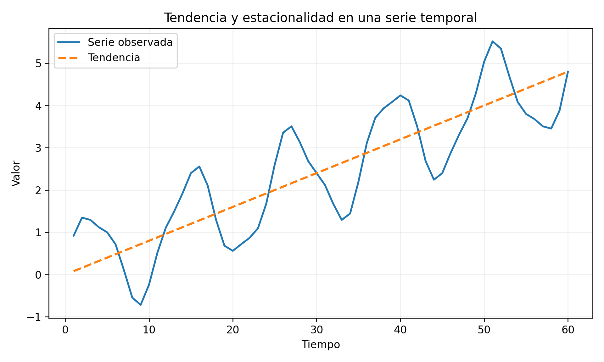
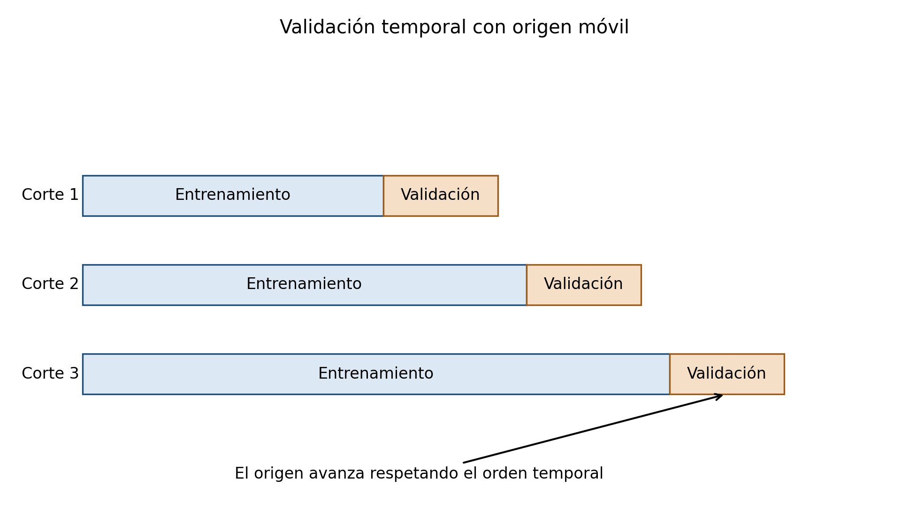

# Series de tiempo\index{Series de tiempo} y aprendizaje automático {#sec-series-tiempo}

## Introducción {.unnumbered}

Una serie de tiempo es una secuencia de observaciones ordenadas cronológicamente. A diferencia de una muestra transversal, el orden contiene información y las observaciones pueden presentar dependencia temporal.

El análisis de series de tiempo busca describir, modelar y pronosticar esta dependencia. Los enfoques clásicos utilizan estructuras como tendencia, estacionalidad, autocorrelación\index{Autocorrelación} y modelos ARIMA\index{ARIMA}. Los métodos de aprendizaje automático transforman la historia temporal en variables predictoras y utilizan árboles, ensambles, redes neuronales u otros algoritmos.

La evaluación correcta exige respetar el orden cronológico. Una partición aleatoria puede mezclar pasado y futuro, producir fuga de información y generar estimaciones excesivamente optimistas.

::: {.callout-important title="Definición esencial" appearance="default" icon="true"}
Una **serie de tiempo** es una sucesión ordenada de variables aleatorias cuya dependencia temporal forma parte de la información del problema. Por ello, entrenamiento, validación y prueba deben respetar el orden cronológico.
:::

{#fig-serie-componentes width=84% fig-alt="Serie temporal oscilante con una tendencia ascendente superpuesta"}

## Objetivos {.unnumbered}

Al finalizar el capítulo, el lector podrá:

1. representar una serie temporal;
2. identificar tendencia y estacionalidad;
3. definir estacionariedad;
4. interpretar autocovarianza y autocorrelación;
5. comprender procesos AR, MA y ARMA;
6. formular modelos ARIMA;
7. interpretar diferenciación;
8. construir variables rezagadas;
9. evitar fuga temporal;
10. diseñar validación temporal;
11. evaluar pronósticos;
12. comprender pronósticos probabilísticos;
13. aplicar árboles, Random Forest y redes neuronales;
14. comparar enfoques estadísticos y de aprendizaje automático.

## Definición {.unnumbered}

La formulación clásica de series temporales puede consultarse en @box2015time, @hamilton1994time y @brockwell2016introduction.

Una serie de tiempo es una colección

$$
\{Y_t:t\in\mathcal{T}\},
$$

donde $t$ representa tiempo.

En tiempo discreto:

$$
t=1,2,\ldots,T.
$$

Una realización observada es

$$
y_1,y_2,\ldots,y_T.
$$

## Componentes {.unnumbered}

Una descomposición aditiva es

$$
Y_t=T_t+S_t+C_t+\varepsilon_t,
$$

donde:

- $T_t$: tendencia;
- $S_t$: estacionalidad;
- $C_t$: ciclo;
- $\varepsilon_t$: componente irregular.

## Modelo multiplicativo {.unnumbered}

Cuando la amplitud estacional aumenta con el nivel:

$$
Y_t=T_tS_tC_t\varepsilon_t.
$$

Aplicando logaritmos se obtiene una forma aditiva.

## Tendencia {.unnumbered}

La tendencia describe el comportamiento de largo plazo.

Puede ser:

- creciente;
- decreciente;
- lineal;
- no lineal;
- localmente cambiante.

## Estacionalidad {.unnumbered}

La estacionalidad es un patrón que se repite con periodo conocido:

$$
S_{t+m}=S_t.
$$

Ejemplos:

- 12 meses;
- 7 días;
- 24 horas;
- 4 trimestres.

## Estacionariedad débil {.unnumbered}

Un proceso es débilmente estacionario si:

$$
\mathbb{E}(Y_t)=\mu
$$

es constante y

$$
\operatorname{Cov}(Y_t,Y_{t+h})
=
\gamma(h)
$$

depende solo del rezago $h$.

## Autocovarianza {.unnumbered}

$$
\gamma(h)
=
\operatorname{Cov}(Y_t,Y_{t-h}).
$$

Para $h=0$:

$$
\gamma(0)=\operatorname{Var}(Y_t).
$$

## Autocorrelación {.unnumbered}

$$
\rho(h)
=
\frac{\gamma(h)}{\gamma(0)}.
$$

Se cumple

$$
-1\leq\rho(h)\leq1.
$$

## ACF muestral {.unnumbered}

$$
\widehat{\rho}(h)
=
\frac{
\sum_{t=h+1}^{T}
(y_t-\overline{y})(y_{t-h}-\overline{y})
}{
\sum_{t=1}^{T}(y_t-\overline{y})^2
}.
$$

La ACF ayuda a detectar dependencia y estacionalidad.

## Ruido blanco {.unnumbered}

Un proceso de ruido blanco satisface:

$$
\mathbb{E}(\varepsilon_t)=0,
$$

$$
\operatorname{Var}(\varepsilon_t)=\sigma^2,
$$

$$
\operatorname{Cov}(\varepsilon_t,\varepsilon_s)=0
\quad (t\neq s).
$$

## Caminata aleatoria {.unnumbered}

$$
Y_t=Y_{t-1}+\varepsilon_t.
$$

No es estacionaria porque su varianza crece con el tiempo.

## Diferenciación {.unnumbered}

La primera diferencia es

$$
\nabla Y_t
=
Y_t-Y_{t-1}.
$$

La diferencia estacional es

$$
\nabla_mY_t
=
Y_t-Y_{t-m}.
$$

Se utilizan para eliminar tendencia o estacionalidad.

## Operador rezago {.unnumbered}

Defínase

$$
BY_t=Y_{t-1}.
$$

Entonces

$$
\nabla Y_t=(1-B)Y_t.
$$

La diferencia de orden $d$ es

$$
\nabla^dY_t=(1-B)^dY_t.
$$

## Modelo autorregresivo AR(p) {.unnumbered}

$$
Y_t
=
c+
\phi_1Y_{t-1}
+\cdots+
\phi_pY_{t-p}
+\varepsilon_t.
$$

El valor presente depende de sus propios rezagos.

## AR(1) {.unnumbered}

$$
Y_t=c+\phi Y_{t-1}+\varepsilon_t.
$$

Para estacionariedad se requiere

$$
|\phi|<1.
$$

Su media es

$$
\mu=\frac{c}{1-\phi}.
$$

## Modelo MA(q) {.unnumbered}

$$
Y_t
=
\mu+
\varepsilon_t+
\theta_1\varepsilon_{t-1}
+\cdots+
\theta_q\varepsilon_{t-q}.
$$

El valor depende de perturbaciones actuales y pasadas.

## Modelo ARMA(p,q) {.unnumbered}

$$
Y_t
=
c+
\sum_{i=1}^{p}\phi_iY_{t-i}
+
\varepsilon_t+
\sum_{j=1}^{q}\theta_j\varepsilon_{t-j}.
$$

Se utiliza para series estacionarias.

## Modelo ARIMA(p,d,q) {.unnumbered}

Una serie se diferencia $d$ veces y se ajusta un ARMA:

$$
\phi(B)(1-B)^dY_t
=
c+\theta(B)\varepsilon_t.
$$

Los parámetros son:

- $p$: orden autorregresivo;
- $d$: diferenciación;
- $q$: media móvil.

## ARIMA estacional {.unnumbered}

$$
ARIMA(p,d,q)(P,D,Q)_m.
$$

Incluye componentes estacionales con periodo $m$.

## Identificación {.unnumbered}

Se utilizan:

- gráfica temporal;
- ACF;
- PACF;
- pruebas de raíz unitaria;
- criterios AIC y BIC;
- diagnóstico de residuos.

## PACF {.unnumbered}

La autocorrelación parcial en rezago $h$ mide la relación entre $Y_t$ y $Y_{t-h}$ controlando rezagos intermedios.

Es útil para identificar órdenes autorregresivos.

## Prueba de raíz unitaria {.unnumbered}

La prueba Dickey-Fuller aumentada contrasta una raíz unitaria.

No rechazar no demuestra estacionariedad; indica evidencia insuficiente contra la raíz unitaria.

## Suavizamiento exponencial {.unnumbered}

El nivel simple se actualiza mediante

$$
\ell_t
=
\alpha y_t+(1-\alpha)\ell_{t-1},
$$

con

$$
0<\alpha<1.
$$

El pronóstico es

$$
\widehat{y}_{t+h|t}=\ell_t.
$$

## Método de Holt {.unnumbered}

Incluye nivel y tendencia:

$$
\ell_t
=
\alpha y_t
+
(1-\alpha)(\ell_{t-1}+b_{t-1}),
$$

$$
b_t
=
\beta(\ell_t-\ell_{t-1})
+
(1-\beta)b_{t-1}.
$$

## Holt-Winters {.unnumbered}

Añade una componente estacional y puede formularse en versión aditiva o multiplicativa.

## Pronóstico h pasos adelante {.unnumbered}

Se denota por

$$
\widehat{Y}_{t+h|t},
$$

la predicción de $Y_{t+h}$ usando información disponible hasta $t$.

## Error de pronóstico {.unnumbered}

$$
e_{t+h|t}
=
Y_{t+h}
-
\widehat{Y}_{t+h|t}.
$$

## MAE {.unnumbered}

$$
MAE
=
\frac{1}{n}
\sum_{i=1}^{n}|e_i|.
$$

## RMSE {.unnumbered}

$$
RMSE
=
\sqrt{
\frac{1}{n}
\sum_{i=1}^{n}e_i^2
}.
$$

## MAPE {.unnumbered}

$$
MAPE
=
\frac{100}{n}
\sum_{i=1}^{n}
\left|
\frac{e_i}{y_i}
\right|.
$$

Es problemático si $y_i$ es cero o cercano a cero.

## MASE {.unnumbered}

$$
MASE
=
\frac{
\frac{1}{n}\sum|e_i|
}{
\frac{1}{T-m}
\sum_{t=m+1}^{T}|y_t-y_{t-m}|
}.
$$

Permite comparación entre series.

::: {.callout-warning title="Precaución al comparar métricas" appearance="default" icon="true"}
MAE y RMSE conservan las unidades de la serie; RMSE penaliza con mayor intensidad los errores grandes. MAPE puede ser inestable cuando los valores observados son cero o cercanos a cero. MASE facilita comparaciones entre series al escalar el error respecto de un pronóstico ingenuo.
:::

## Pronósticos probabilísticos {.unnumbered}

Un pronóstico completo puede ser una distribución:

$$
P(Y_{t+h}\mid\mathcal{F}_t).
$$

Puede resumirse mediante:

- intervalos;
- cuantiles;
- densidades;
- simulaciones.

## Cobertura de intervalos {.unnumbered}

Un intervalo nominal del 95 por ciento debe contener aproximadamente el 95 por ciento de observaciones futuras bajo calibración correcta.

## Variables rezagadas {.unnumbered}

Para aprendizaje automático se construyen:

$$
X_{t,1}=Y_{t-1},
$$

$$
X_{t,2}=Y_{t-2},
$$

y así sucesivamente.

También pueden incluirse:

- medias móviles;
- máximos;
- mínimos;
- calendario;
- variables externas.

## Ventanas móviles {.unnumbered}

Una media de ventana $w$ es

$$
M_t^{(w)}
=
\frac{1}{w}
\sum_{j=1}^{w}Y_{t-j}.
$$

Debe calcularse usando únicamente información anterior a $t$.

## Variables de calendario {.unnumbered}

Pueden incluir:

- hora;
- día de semana;
- mes;
- trimestre;
- festivos;
- temporada.

Para variables cíclicas puede utilizarse:

$$
\sin
\left(
\frac{2\pi t}{m}
\right),
\qquad
\cos
\left(
\frac{2\pi t}{m}
\right).
$$

## Variables exógenas {.unnumbered}

Un modelo puede incluir

$$
\mathbf{X}_t.
$$

Por ejemplo:

$$
Y_t
=
f
\left(
Y_{t-1},\ldots,Y_{t-p},
\mathbf{X}_t
\right).
$$

Para pronosticar se necesitan valores futuros o pronósticos de las variables exógenas.

## Fuga temporal {.unnumbered}

Existe fuga si una variable usa información futura.

Ejemplos:

- media móvil centrada;
- escalamiento con toda la serie;
- imputación usando valores posteriores;
- selección de variables con el periodo de prueba;
- partición aleatoria.

## División temporal {.unnumbered}

La partición correcta respeta:

$$
\text{entrenamiento}
<
\text{validación}
<
\text{prueba}.
$$

El futuro nunca debe utilizarse para construir el pasado.

## Validación con origen móvil {.unnumbered}


{#fig-validacion-origen-movil width=88% fig-alt="Tres cortes temporales con ventanas de entrenamiento y validación sucesivas"}


En cada iteración se entrena con información hasta un tiempo y se evalúa en periodos posteriores.

Puede usarse:

- ventana expansiva;
- ventana deslizante.

## Ventana expansiva {.unnumbered}

El conjunto de entrenamiento crece:

$$
\{1,\ldots,t\}
\to
\{1,\ldots,t+1\}.
$$

## Ventana deslizante {.unnumbered}

Se mantiene una longitud fija:

$$
\{t-w+1,\ldots,t\}.
$$

Es útil cuando existe cambio de distribución.

## Pronóstico recursivo {.unnumbered}

Para múltiples pasos, la predicción anterior se utiliza como entrada:

$$
\widehat{Y}_{t+2|t}
=
f
\left(
\widehat{Y}_{t+1|t},Y_t,\ldots
\right).
$$

Los errores pueden acumularse.

## Pronóstico directo {.unnumbered}

Se entrena un modelo diferente para cada horizonte:

$$
f_1,f_2,\ldots,f_H.
$$

Reduce acumulación, pero requiere más modelos.

## Estrategia multioutput {.unnumbered}

Un modelo produce simultáneamente:

$$
(\widehat{Y}_{t+1},\ldots,\widehat{Y}_{t+H}).
$$

## Árboles y bosques {.unnumbered}

Random Forest puede usar:

- rezagos;
- estadísticas móviles;
- variables calendario;
- variables meteorológicas.

Ventajas:

- no linealidad;
- interacciones;
- poca transformación.

Limitación: extrapola mal tendencias fuera del rango de entrenamiento.

## Gradient boosting {.unnumbered}

Los modelos boosting suelen ser muy competitivos en series tabulares con variables rezagadas.

Requieren validación temporal y control de sobreajuste.

## Redes neuronales recurrentes {.unnumbered}

Una RNN actualiza un estado:

$$
\mathbf{h}_t
=
\phi
\left(
\mathbf{W}_x\mathbf{x}_t
+
\mathbf{W}_h\mathbf{h}_{t-1}
+
\mathbf{b}
\right).
$$

El estado resume información pasada.

## Gradientes en RNN {.unnumbered}

La retropropagación a través del tiempo multiplica Jacobianas repetidamente, lo cual puede producir gradientes desvanecientes o explosivos.

## LSTM {.unnumbered}

Las redes LSTM introducen compuertas para controlar el flujo de información [@hochreiter1997long].

Incluyen:

- compuerta de olvido;
- compuerta de entrada;
- estado de celda;
- compuerta de salida.

## Atención y transformers {.unnumbered}

Los transformers modelan dependencias mediante atención:

$$
Attention(Q,K,V)
=
softmax
\left(
\frac{QK^{\mathsf T}}{\sqrt{d_k}}
\right)V.
$$

Permiten relacionar posiciones distantes sin recurrencia estricta.

## Modelos híbridos {.unnumbered}

Puede combinarse:

- ARIMA para estructura lineal;
- aprendizaje automático para residuos;
- descomposición estacional;
- modelos separados por componentes.

## Pronóstico jerárquico {.unnumbered}

En datos agregados, los pronósticos deben ser coherentes:

$$
Y_{\text{total}}
=
\sum_jY_j.
$$

Se emplean métodos de reconciliación.

## Series múltiples {.unnumbered}

Una colección de series puede compartir información.

Se distinguen:

- modelos locales: uno por serie;
- modelos globales: un modelo común.

## Concept drift {.unnumbered}

La relación temporal puede cambiar.

Se requiere monitorear:

- error;
- distribución;
- residuos;
- importancia de variables;
- calibración.

## Residuos {.unnumbered}

Un modelo adecuado debe dejar residuos aproximadamente:

- centrados en cero;
- sin autocorrelación;
- con varianza estable;
- sin estructura sistemática.

## Prueba Ljung-Box {.unnumbered}

Contrasta autocorrelaciones conjuntas de residuos.

Rechazar sugiere dependencia temporal no modelada.

## Selección de modelos {.unnumbered}

AIC:

$$
AIC=-2\log L+2k.
$$

BIC:

$$
BIC=-2\log L+k\log n.
$$

En aprendizaje automático debe priorizarse desempeño fuera de muestra mediante validación temporal.

## Línea base {.unnumbered}

Todo modelo debe compararse con referencias simples:

- último valor;
- media;
- tendencia;
- pronóstico estacional ingenuo.

Un modelo complejo que no supera la línea base no agrega valor.

## Pronóstico ingenuo {.unnumbered}

$$
\widehat{Y}_{t+h|t}=Y_t.
$$

## Ingenuo estacional {.unnumbered}

$$
\widehat{Y}_{t+h|t}=Y_{t+h-m}.
$$

## Intervalos y aprendizaje automático {.unnumbered}

Puede utilizarse:

- regresión cuantílica;
- conformal prediction;
- bootstrap temporal;
- ensambles;
- modelos probabilísticos.

## Evaluación por horizonte {.unnumbered}

El error debe analizarse para cada horizonte:

$$
MAE(h),
\qquad
RMSE(h).
$$

Un modelo puede ser bueno a corto plazo y malo a largo plazo.

## Seudocódigo formal para pronóstico con validación temporal {.unnumbered}

::: {.callout-note title="Seudocódigo matemático formal" appearance="default" icon="true"}
```text
Algoritmo Pronóstico-con-Origen-Móvil
Entrada:
  serie y_1,...,y_T, horizonte h,
  puntos de corte τ_1<...<τ_K,
  algoritmo de ajuste A
Salida:
  errores de validación temporal

1. Para k = 1,...,K:
   a) Definir el conjunto de entrenamiento
         D_k = {y_1,...,y_{τ_k}}.
   b) Ajustar el modelo
         M_k = A(D_k).
   c) Pronosticar
         \hat y_{τ_k+j|τ_k},
         j=1,...,h.
   d) Comparar con los valores observados
         y_{τ_k+1},...,y_{τ_k+h}.
   e) Calcular la pérdida por horizonte
         \ell_{k,j}
         = L(y_{τ_k+j},
             \hat y_{τ_k+j|τ_k}).
2. Agregar los resultados:
      \widehat R_j
      = (1/K)\sum_{k=1}^K \ell_{k,j},
      j=1,...,h.
3. Reportar el error global y el error específico por horizonte.
```
:::

## Aplicación ambiental {.unnumbered}

Para pronosticar PM10 pueden utilizarse:

- PM10 rezagado;
- temperatura;
- humedad;
- viento;
- hora;
- día;
- estacionalidad;
- variables de otras estaciones.

La validación debe simular el uso operativo real.

## Conexión con R {.unnumbered}

```{r}
#| eval: false

library(forecast)

serie <- ts(
  c(45, 48, 50, 47, 55, 60, 58, 62, 65, 63, 68, 70),
  frequency = 12
)

modelo <- auto.arima(serie)

pronostico <- forecast(
  modelo,
  h = 6
)

plot(pronostico)

# Variables rezagadas para aprendizaje automático
crear_rezagos <- function(x, p = 3) {
  resultado <- data.frame(y = x)

  for (j in seq_len(p)) {
    resultado[[paste0("lag_", j)]] <- dplyr::lag(x, j)
  }

  na.omit(resultado)
}
```

## Ejemplo AR(1) {.unnumbered}

Sea

$$
Y_t=2+0.7Y_{t-1}+\varepsilon_t.
$$

La media estacionaria es

$$
\mu=\frac{2}{1-0.7}
=
\frac{20}{3}.
$$

## Ejemplo de diferencia {.unnumbered}

Para:

$$
100,\;105,\;111,\;115,
$$

las primeras diferencias son:

$$
5,\;6,\;4.
$$

## Ejemplo de variable rezagada {.unnumbered}

Para predecir $Y_t$ con tres rezagos:

$$
\mathbf{x}_t
=
(Y_{t-1},Y_{t-2},Y_{t-3}).
$$

La primera fila utilizable aparece en $t=4$.

## Ventajas de los enfoques clásicos {.unnumbered}

1. interpretación;
2. intervalos probabilísticos;
3. buen desempeño con pocos datos;
4. teoría desarrollada;
5. diagnóstico de residuos.

## Ventajas del aprendizaje automático {.unnumbered}

1. no linealidad;
2. numerosas variables;
3. interacciones;
4. series múltiples;
5. flexibilidad.

## Limitaciones {.unnumbered}

1. dependencia temporal;
2. riesgo de fuga;
3. cambio de distribución;
4. incertidumbre futura;
5. horizontes múltiples;
6. necesidad de validación realista;
7. extrapolación limitada en árboles.

## Errores frecuentes {.unnumbered}

1. dividir aleatoriamente;
2. calcular rezagos con información futura;
3. ajustar escalamiento con toda la serie;
4. evaluar solo un horizonte;
5. omitir una línea base;
6. usar MAPE con ceros;
7. ignorar autocorrelación residual;
8. seleccionar modelos con prueba final;
9. confundir ajuste histórico con pronóstico;
10. usar variables exógenas futuras desconocidas.

## Ejercicios conceptuales {.unnumbered}

1. Defina estacionariedad.
2. Distinga tendencia y estacionalidad.
3. Interprete ACF y PACF.
4. Compare AR y MA.
5. Explique ARIMA.
6. ¿Qué es fuga temporal?
7. Compare ventana expansiva y deslizante.
8. Compare pronóstico recursivo y directo.
9. ¿Por qué se necesitan líneas base?
10. Compare modelos clásicos y aprendizaje automático.

## Ejercicio AR(1) {.unnumbered}

Sea:

$$
Y_t=1+0.5Y_{t-1}+\varepsilon_t.
$$

1. Verifique estacionariedad.
2. Calcule la media.
3. Pronostique un paso si $Y_t=10$ y $\mathbb{E}(\varepsilon)=0$.

## Ejercicio de métricas {.unnumbered}

Observados:

$$
10,\;12,\;15,\;20.
$$

Pronósticos:

$$
11,\;10,\;14,\;22.
$$

Calcule:

1. errores;
2. MAE;
3. RMSE;
4. MAPE.

## Ejercicio de validación {.unnumbered}

Diseñe una validación de origen móvil para 60 meses:

- 36 meses iniciales;
- horizonte de 3 meses;
- ventana expansiva.

Indique las particiones sucesivas.

## Ejercicio aplicado {.unnumbered}

Diseñe un sistema para pronosticar PM10 diario que incluya:

1. limpieza;
2. imputación temporal;
3. tendencia;
4. estacionalidad;
5. rezagos;
6. variables meteorológicas;
7. línea base;
8. ARIMA;
9. Random Forest;
10. boosting;
11. validación temporal;
12. métricas por horizonte;
13. intervalos;
14. monitoreo de drift;
15. limitaciones ambientales.

## Resumen {.unnumbered}

En este capítulo se desarrollaron los fundamentos de las series de tiempo y su relación con aprendizaje automático.

Se estudiaron tendencia, estacionalidad, estacionariedad, autocorrelación, ruido blanco, diferenciación y modelos AR, MA, ARMA y ARIMA.

También se analizaron suavizamiento exponencial, pronósticos probabilísticos, métricas, rezagos, ventanas móviles y variables exógenas.

Finalmente, se desarrollaron validación temporal, estrategias multihorizonte, árboles, ensambles, RNN, LSTM, transformers, modelos híbridos, monitoreo y prevención de fuga temporal.

## Referencias del capítulo {.unnumbered}

Los fundamentos se apoyan en @box2015time, @hamilton1994time, @hyndman2021forecasting y @hochreiter1997long.
