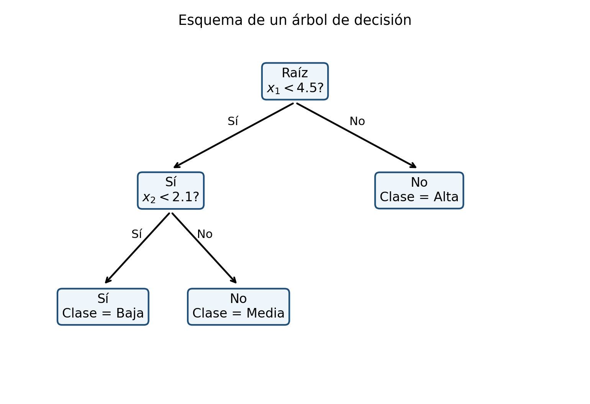

# Árbol\index{Árboles de decisión}es de decisión {#sec-arboles-decision}

## Introducción {.unnumbered}

Los árboles de decisión particionan recursivamente el espacio predictor mediante reglas simples. Su interpretabilidad es atractiva, pero un árbol profundo puede tener alta varianza y sobreajustar [@breiman1984cart; @quinlan1986induction; @quinlan1993c45].

Los árboles de decisión son modelos supervisados que dividen recursivamente el espacio de características en regiones cada vez más homogéneas. Cada división se expresa mediante una regla sencilla, por ejemplo,

$$
X_j \leq s,
$$

donde $X_j$ es una característica y $s$ es un punto de corte.

El modelo final tiene una estructura jerárquica formada por nodos internos, ramas y hojas terminales. En clasificación, cada hoja asigna una clase o una distribución de probabilidades; en regresión, asigna un valor numérico, habitualmente la media de las respuestas que llegan a esa hoja.

Los árboles destacan por su interpretabilidad, su capacidad de representar relaciones no lineales e interacciones, y su escasa necesidad de transformaciones previas. Sin embargo, un árbol profundo puede presentar alta varianza y sobreajuste. Por ello, su construcción requiere criterios de impureza, reglas de parada y procedimientos de poda.

::: {.callout-important title="Definición esencial" appearance="default" icon="true"}
Un árbol divide recursivamente el espacio de predictores mediante reglas simples.
:::

## Objetivos {.unnumbered}

Al finalizar el capítulo, el lector podrá:

1. formular un árbol como una partición recursiva del espacio;
2. distinguir nodos, ramas y hojas;
3. definir impureza de Gini\index{Índice de Gini} y entropía\index{Entropía};
4. calcular ganancia de información;
5. formular divisiones para variables numéricas y categóricas;
6. construir árboles de clasificación y regresión;
7. comprender los algoritmos ID3, C4.5 y CART;
8. analizar sobreajuste y profundidad;
9. comprender la poda por complejidad de costo;
10. interpretar probabilidades en hojas;
11. analizar sesgo, varianza e inestabilidad;
12. evaluar importancia de variables;
13. reconocer limitaciones de la importancia basada en impureza;
14. conectar árboles con random forest y boosting.

## Estructura de un árbol {.unnumbered}

Un árbol está formado por:

- **nodo raíz:** contiene todas las observaciones;
- **nodos internos:** aplican reglas de división;
- **ramas:** representan resultados de las reglas;
- **hojas terminales:** producen la predicción.

Cada observación recorre el árbol desde la raíz hasta una hoja.

## Representación mediante regiones {.unnumbered}

Sea el espacio de entrada

$$
\mathcal{X}\subseteq\mathbb{R}^p.
$$

Un árbol induce una partición

$$
\mathcal{X}
=
R_1\cup R_2\cup\cdots\cup R_M,
$$

donde las regiones son disjuntas:

$$
R_m\cap R_\ell=\varnothing,
\qquad m\neq \ell.
$$

Cada hoja corresponde a una región $R_m$.

## Regla de predicción en clasificación {.unnumbered}

Sea

$$
N_m
=
\{i:\mathbf{x}_i\in R_m\}
$$

el conjunto de observaciones de entrenamiento que pertenecen a la hoja $m$.

La proporción estimada de la clase $c$ es

$$
\widehat{p}_{mc}
=
\frac{1}{|N_m|}
\sum_{i\in N_m}
\mathbb{I}(y_i=c).
$$

La clase predicha es

$$
\widehat{g}(\mathbf{x})
=
\arg\max_c \widehat{p}_{mc},
\qquad
\mathbf{x}\in R_m.
$$

## Regla de predicción en regresión {.unnumbered}

En regresión, la predicción de la hoja es

$$
\widehat{c}_m
=
\frac{1}{|N_m|}
\sum_{i\in N_m}y_i.
$$

Por tanto,

$$
\widehat{f}(\mathbf{x})
=
\sum_{m=1}^{M}
\widehat{c}_m
\mathbb{I}(\mathbf{x}\in R_m).
$$

El árbol de regresión es una función constante por regiones.

## División binaria {.unnumbered}

En CART, cada nodo se divide en dos hijos. Para una variable numérica $X_j$, una división tiene la forma

$$
R_{\text{izq}}(j,s)
=
\{\mathbf{x}:x_j\leq s\},
$$

$$
R_{\text{der}}(j,s)
=
\{\mathbf{x}:x_j>s\}.
$$

El algoritmo busca la pareja $(j,s)$ que produce la mayor reducción de impureza.

## Impureza de un nodo {.unnumbered}

Sea $t$ un nodo y

$$
\widehat{p}_{tc}
=
\frac{n_{tc}}{n_t},
$$

donde $n_{tc}$ es el número de observaciones de clase $c$ y $n_t$ el total del nodo.

Una medida de impureza cuantifica cuán mezcladas están las clases dentro del nodo.

## Error de clasificación {.unnumbered}

La impureza basada en error de clasificación es

$$
I_E(t)
=
1-\max_c \widehat{p}_{tc}.
$$

Es intuitiva, pero poco sensible a cambios en las probabilidades y por ello se usa menos para construir el árbol.

## Impureza de Gini {.unnumbered}

::: {#def-gini}
La impureza de Gini de un nodo es

$$
I_G(t)
=
1-
\sum_{c=1}^{C}
\widehat{p}_{tc}^{\,2}.
$$
:::

También puede escribirse como

$$
I_G(t)
=
\sum_{c=1}^{C}
\widehat{p}_{tc}
\left(
1-\widehat{p}_{tc}
\right).
$$

En clasificación binaria, si $p$ es la proporción de la clase positiva,

$$
I_G(t)=2p(1-p).
$$

::: {.callout-note title="Impureza y error de clasificación" appearance="default" icon="true"}
Entropía y Gini se utilizan para construir el árbol porque son más sensibles a cambios en las probabilidades de clase que el error de clasificación. Una menor impureza local no garantiza por sí sola mejor desempeño fuera de muestra.
:::

{#fig-arbol-esquema width=78% fig-alt="Esquema de un árbol con nodo raíz, nodos internos y hojas"}

## Entropía {.unnumbered}

::: {#def-entropia-arbol}
La entropía de un nodo es

$$
H(t)
=
-
\sum_{c=1}^{C}
\widehat{p}_{tc}
\log_2 \widehat{p}_{tc},
$$

con la convención $0\log 0=0$.
:::

La entropía es cero en un nodo puro y alcanza su máximo cuando las clases están distribuidas uniformemente.

## Comparación entre Gini y entropía {.unnumbered}

Ambas medidas:

- valen cero en nodos puros;
- aumentan con la mezcla de clases;
- suelen producir árboles semejantes;
- penalizan más la mezcla que el error de clasificación.

CART utiliza habitualmente Gini; ID3 y C4.5 utilizan entropía.

## Impureza ponderada después de una división {.unnumbered}

Si un nodo $t$ se divide en hijos $t_L$ y $t_R$, la impureza posterior es

$$
I_{\text{div}}
=
\frac{n_L}{n_t}I(t_L)
+
\frac{n_R}{n_t}I(t_R).
$$

La reducción de impureza es

$$
\Delta I
=
I(t)-I_{\text{div}}.
$$

Se elige la división que maximiza $\Delta I$.

## Ganancia de información {.unnumbered}

Cuando se usa entropía,

$$
IG
=
H(t)
-
\sum_{v}
\frac{n_v}{n_t}H(t_v).
$$

La ganancia de información mide la reducción esperada de incertidumbre producida por una división.

## Ejemplo de Gini {.unnumbered}

Supóngase un nodo con 10 observaciones:

- 6 de clase A;
- 4 de clase B.

Entonces,

$$
\widehat{p}_A=0.6,
\qquad
\widehat{p}_B=0.4.
$$

La impureza es

$$
I_G
=
1-(0.6^2+0.4^2)
=
0.48.
$$

Si una división genera dos nodos casi puros, la impureza ponderada disminuirá notablemente.

## Árboles de regresión {.unnumbered}

Para regresión, se busca minimizar la suma de cuadrados dentro de las hojas.

Para una región $R_m$, el valor óptimo es

$$
\widehat{c}_m
=
\operatorname*{arg\,min}_{c}
\sum_{i:\mathbf{x}_i\in R_m}
(y_i-c)^2.
$$

La solución es la media:

$$
\widehat{c}_m
=
\overline{y}_{R_m}.
$$

## Criterio de división en regresión {.unnumbered}

Para una división $(j,s)$ se minimiza

$$
\sum_{i:x_{ij}\leq s}
\left(
y_i-\overline{y}_L
\right)^2
+
\sum_{i:x_{ij}>s}
\left(
y_i-\overline{y}_R
\right)^2.
$$

Equivalentemente, se maximiza la reducción de suma de cuadrados.

## Partición recursiva {.unnumbered}

El árbol se construye de manera codiciosa:

1. se evalúan todas las divisiones candidatas;
2. se selecciona la mejor división local;
3. se divide el nodo;
4. se repite el proceso en cada nodo hijo.

El procedimiento es codicioso porque no reconsidera globalmente decisiones anteriores.

## Variables numéricas {.unnumbered}

Para una variable numérica ordenada, los puntos de corte candidatos suelen ubicarse entre valores consecutivos distintos:

$$
s_r
=
\frac{x_{(r)}+x_{(r+1)}}{2}.
$$

No es necesario evaluar todos los números reales.

## Variables categóricas {.unnumbered}

Para una variable categórica con niveles

$$
\{a_1,\ldots,a_K\},
$$

una división puede separar un subconjunto de categorías del resto.

El número de particiones posibles crece rápidamente, por lo que los algoritmos utilizan estrategias eficientes o codificaciones específicas.

## Algoritmo ID3 {.unnumbered}

ID3 construye árboles de clasificación utilizando:

- entropía;
- ganancia de información;
- divisiones generalmente múltiples;
- variables categóricas en su formulación original.

En cada nodo selecciona la variable con mayor ganancia de información.

## Sesgo de la ganancia de información {.unnumbered}

Una variable con muchos niveles puede producir una ganancia artificialmente alta, al crear grupos pequeños o incluso puros.

Este problema motivó el criterio de razón de ganancia de C4.5.

## C4.5 {.unnumbered}

C4.5 extiende ID3 mediante:

- manejo de variables continuas;
- tratamiento de valores faltantes;
- razón de ganancia;
- poda posterior;
- conversión opcional a reglas.

## Razón de ganancia {.unnumbered}

La información de división es

$$
SplitInfo
=
-
\sum_v
\frac{n_v}{n_t}
\log_2
\left(
\frac{n_v}{n_t}
\right).
$$

La razón de ganancia es

$$
GainRatio
=
\frac{IG}{SplitInfo}.
$$

Este criterio penaliza divisiones que producen demasiados grupos.

## CART {.unnumbered}

CART significa *Classification and Regression Trees*.

Sus características principales son:

- divisiones binarias;
- Gini para clasificación;
- suma de cuadrados para regresión;
- construcción de un árbol grande;
- poda por complejidad de costo.

## Profundidad del árbol {.unnumbered}

La profundidad es el número máximo de divisiones desde la raíz hasta una hoja.

Un árbol profundo:

- se adapta intensamente a la muestra;
- puede representar interacciones complejas;
- suele tener bajo sesgo;
- puede presentar alta varianza.

Un árbol poco profundo:

- es más estable;
- es más fácil de interpretar;
- puede presentar subajuste.

## Parámetros de control {.unnumbered}

Los hiperparámetros comunes incluyen:

- profundidad máxima;
- número mínimo de observaciones para dividir;
- número mínimo de observaciones por hoja;
- reducción mínima de impureza;
- número máximo de hojas;
- parámetro de complejidad.

## Crecimiento máximo {.unnumbered}

Una estrategia consiste en hacer crecer un árbol grande hasta que:

- los nodos sean puros;
- no haya suficientes observaciones;
- no exista mejora apreciable;
- se alcance una restricción de profundidad.

Posteriormente se aplica poda.

## Sobreajuste {.unnumbered}

Un árbol sin control puede aprender particularidades y ruido de la muestra. Esto suele manifestarse como:

- error de entrenamiento muy bajo;
- error de validación alto;
- hojas con pocas observaciones;
- fronteras de decisión extremadamente irregulares.

::: {.callout-important title="Crecimiento y poda" appearance="default" icon="true"}
En CART suele crecerse un árbol amplio y después podarse mediante complejidad-costo. La poda debe seleccionarse con validación para equilibrar ajuste y complejidad.
:::

Los árboles de clasificación y regresión fueron sistematizados por @breiman1984cart, mientras que @quinlan1986induction y @quinlan1993c45 desarrollaron esquemas de partición e inducción ampliamente utilizados.

## Poda {.unnumbered}

::: {#def-poda}
La poda elimina ramas de un árbol grande para producir un modelo más simple y mejorar la generalización.
:::

Puede realizarse:

- durante el crecimiento, mediante parada anticipada;
- después del crecimiento, mediante poda posterior.

## Poda por complejidad de costo {.unnumbered}

Para un árbol $T$, CART define

$$
R_\alpha(T)
=
R(T)+\alpha |T|,
$$

donde:

- $R(T)$ es el error o impureza del árbol;
- $|T|$ es el número de hojas;
- $\alpha\geq 0$ controla la penalización por complejidad.

Cuando $\alpha$ aumenta, se favorecen árboles más pequeños.

## Secuencia de subárboles {.unnumbered}

La poda de eslabón más débil produce una secuencia anidada

$$
T_0\supset T_1\supset\cdots\supset T_L,
$$

desde el árbol máximo hasta el árbol raíz.

La selección del subárbol se realiza mediante validación cruzada.

## Selección mediante validación cruzada {.unnumbered}

Se estima el error

$$
CV(\alpha)
$$

para diferentes valores de $\alpha$.

Se elige

$$
\widehat{\alpha}
=
\operatorname*{arg\,min}_{\alpha}CV(\alpha).
$$

También puede utilizarse la regla de un error estándar para seleccionar un árbol más pequeño.

## Interpretación de una ruta {.unnumbered}

Una ruta desde la raíz hasta una hoja representa una conjunción de condiciones.

Por ejemplo:

$$
X_1\leq 20,
\qquad
X_3>5,
\qquad
X_2\in\{A,C\}.
$$

La hoja puede traducirse en una regla fácilmente comunicable.

## Interacciones automáticas {.unnumbered}

Los árboles representan interacciones sin introducir explícitamente productos entre variables.

Si una división sobre $X_2$ aparece únicamente después de una división sobre $X_1$, el efecto de $X_2$ depende de la región definida por $X_1$.

## No linealidad {.unnumbered}

Los árboles pueden aproximar relaciones no lineales mediante divisiones escalonadas. En regresión, la función resultante es constante por regiones.

Aunque esto proporciona flexibilidad, puede producir predicciones discontinuas.

## Invariancia a transformaciones monótonas {.unnumbered}

Como las divisiones dependen principalmente del orden de los valores, un árbol es generalmente invariante ante transformaciones estrictamente monótonas de una variable numérica.

Por ejemplo, aplicar logaritmo a una variable positiva puede cambiar los puntos numéricos, pero no necesariamente el orden ni la partición óptima.

## Escalamiento {.unnumbered}

A diferencia de $k$-NN o SVM, los árboles no suelen requerir estandarización, porque las divisiones se realizan variable por variable.

Esta es una ventaja práctica importante.

## Valores faltantes {.unnumbered}

Según el algoritmo, pueden tratarse mediante:

- imputación;
- divisiones sustitutas;
- categorías especiales;
- distribución probabilística entre ramas.

La estrategia debe aprenderse únicamente con datos de entrenamiento.

## Probabilidades en las hojas {.unnumbered}

Una hoja no solo produce una clase. También puede estimar probabilidades:

$$
\widehat{P}(Y=c\mid\mathbf{x}\in R_m)
=
\widehat{p}_{mc}.
$$

Sin embargo, hojas pequeñas pueden producir probabilidades extremas e inestables.

## Suavizamiento de probabilidades {.unnumbered}

Puede aplicarse suavizamiento de Laplace:

$$
\widetilde{p}_{mc}
=
\frac{n_{mc}+\lambda}
{n_m+C\lambda}.
$$

Con $\lambda=1$, se evita obtener probabilidades exactamente cero en hojas pequeñas.

## Clases desbalanceadas {.unnumbered}

En datos desbalanceados, un árbol puede favorecer la clase mayoritaria.

Estrategias:

- pesos por clase;
- costos de error asimétricos;
- muestreo;
- umbral ajustado;
- métricas adecuadas;
- restricciones de tamaño por hoja.

## Pérdidas asimétricas {.unnumbered}

Sea $L(a,c)$ el costo de predecir $a$ cuando la clase real es $c$.

La decisión óptima en una hoja es

$$
\widehat{a}_m
=
\operatorname*{arg\,min}_a
\sum_c
L(a,c)\widehat{p}_{mc}.
$$

Así, la clase predicha no tiene que ser necesariamente la más frecuente.

## Importancia por reducción de impureza {.unnumbered}

La importancia de la variable $j$ puede definirse como la suma de las reducciones de impureza producidas por divisiones sobre esa variable:

$$
VI_j
=
\sum_{t:v(t)=j}
\frac{n_t}{n}
\Delta I_t.
$$

## Limitaciones de la importancia por impureza {.unnumbered}

Esta medida puede favorecer variables:

- continuas;
- con muchos valores distintos;
- categóricas con numerosos niveles.

Por ello, debe interpretarse con cautela.

## Importancia por permutación {.unnumbered}

La importancia por permutación mide cuánto aumenta el error al desordenar los valores de una variable:

$$
PI_j
=
\operatorname{Error}_{perm(j)}
-
\operatorname{Error}_{base}.
$$

Esta medida se relaciona más directamente con el desempeño predictivo, aunque puede verse afectada por variables correlacionadas.

## Inestabilidad {.unnumbered}

Los árboles presentan alta inestabilidad: pequeños cambios en la muestra pueden producir estructuras muy diferentes.

Esto ocurre porque una modificación pequeña puede cambiar la mejor división en un nodo superior y alterar todas las divisiones posteriores.

## Sesgo y varianza {.unnumbered}

Un árbol profundo suele presentar:

- bajo sesgo;
- alta varianza.

Un árbol podado suele presentar:

- mayor sesgo;
- menor varianza.

Esta propiedad motiva los métodos de ensamble, como bagging y random forest.

## Complejidad computacional {.unnumbered}

En una implementación eficiente, el costo depende de:

- número de observaciones;
- número de variables;
- número de puntos de corte;
- profundidad;
- tratamiento de variables categóricas.

La predicción es rápida porque solo requiere recorrer una ruta desde la raíz hasta una hoja.

## Fronteras de decisión {.unnumbered}

Con divisiones univariadas, las fronteras son paralelas a los ejes coordenados.

Esto permite representar regiones rectangulares, pero puede ser ineficiente para fronteras oblicuas.

## Árboles oblicuos {.unnumbered}

Una extensión utiliza divisiones de la forma

$$
\mathbf{a}^{\mathsf T}\mathbf{x}\leq s.
$$

Estas divisiones pueden representar fronteras inclinadas, aunque son más costosas y menos interpretables.

## Relación con minimización del riesgo empírico {.unnumbered}

Un árbol busca una función por regiones que minimice una pérdida empírica, sujeta a una estructura jerárquica.

La poda añade una penalización de complejidad:

$$
\widehat{T}
=
\operatorname*{arg\,min}_{T}
\left\{
\widehat{R}(T)+\alpha |T|
\right\}.
$$

## Relación con random forest {.unnumbered}

Random forest reduce la varianza mediante:

- múltiples muestras bootstrap;
- crecimiento de muchos árboles;
- selección aleatoria de variables;
- promedio o voto.

El árbol individual es, por tanto, la unidad básica de random forest.

## Relación con boosting {.unnumbered}

Boosting construye árboles secuencialmente, haciendo que cada nuevo árbol corrija errores del conjunto anterior.

Generalmente utiliza árboles pequeños como aprendices débiles.

## Conexión con R {.unnumbered}

```{r}
#| eval: false

library(rpart)
library(rpart.plot)

datos <- data.frame(
  severo = factor(c("No", "No", "No", "Sí", "Sí", "Sí", "No", "Sí")),
  velocidad = c(35, 42, 48, 70, 80, 75, 55, 90),
  noche = factor(c(0, 0, 1, 1, 1, 0, 0, 1)),
  lluvia = factor(c(0, 1, 0, 1, 0, 1, 0, 1))
)

modelo <- rpart(
  severo ~ velocidad + noche + lluvia,
  data = datos,
  method = "class",
  control = rpart.control(
    cp = 0.01,
    minsplit = 2,
    maxdepth = 3
  )
)

rpart.plot(modelo)

# Tabla de complejidad
printcp(modelo)

# Poda
cp_optimo <- modelo$cptable[
  which.min(modelo$cptable[, "xerror"]),
  "CP"
]

modelo_podado <- prune(modelo, cp = cp_optimo)

# Probabilidades
predict(modelo_podado, type = "prob")

# Clases
predict(modelo_podado, type = "class")
```

## Ejemplo de ganancia de información {.unnumbered}

Supóngase un nodo con 12 observaciones:

- 7 positivas;
- 5 negativas.

La entropía inicial es

$$
H(t)
=
-
\frac{7}{12}\log_2\left(\frac{7}{12}\right)
-
\frac{5}{12}\log_2\left(\frac{5}{12}\right).
$$

Una división produce:

- nodo izquierdo: 6 positivas y 1 negativa;
- nodo derecho: 1 positiva y 4 negativas.

La entropía posterior es

$$
H_{\text{div}}
=
\frac{7}{12}H(t_L)
+
\frac{5}{12}H(t_R).
$$

La ganancia es

$$
IG=H(t)-H_{\text{div}}.
$$

## Ejemplo de árbol de regresión {.unnumbered}

Supóngase que una división genera:

$$
R_1=\{X\leq 10\},
\qquad
R_2=\{X>10\}.
$$

Si las respuestas en $R_1$ son

$$
5,\;7,\;8,
$$

la predicción de la primera hoja es

$$
\widehat{c}_1
=
\frac{5+7+8}{3}
=
\frac{20}{3}.
$$

Si las respuestas en $R_2$ son

$$
15,\;18,\;21,
$$

la predicción es

$$
\widehat{c}_2=18.
$$

## Seudocódigo formal {.unnumbered}

::: {.callout-note title="Seudocódigo matemático formal" appearance="default" icon="true"}
```text
Algoritmo Árbol-de-Decisión
Entrada:
  nodo t con subconjunto D_t
Salida:
  subárbol T_t

1. Si D_t es puro o se cumple un criterio de parada,
      declarar t como hoja y asignar su clase/predicción.
2. Para cada variable j y cada punto de corte s factible:
      calcular la impureza de la partición
         D_t^L(j,s), D_t^R(j,s).
3. Seleccionar (j*, s*) que minimice la impureza o maximice la ganancia.
4. Crear dos nodos hijos:
      t_L con D_t^L(j*,s*),
      t_R con D_t^R(j*,s*).
5. Aplicar recursivamente el procedimiento a t_L y t_R.
6. Si se usa poda, seleccionar el subárbol óptimo según un criterio de complejidad.
```
:::

## Ventajas {.unnumbered}

1. interpretación sencilla;
2. representación automática de interacciones;
3. modelado de relaciones no lineales;
4. poca necesidad de escalamiento;
5. manejo de variables numéricas y categóricas;
6. predicción rápida;
7. utilidad para clasificación y regresión.

## Limitaciones {.unnumbered}

1. alta varianza;
2. sensibilidad a pequeños cambios;
3. fronteras paralelas a los ejes;
4. predicciones escalonadas en regresión;
5. posible sesgo en importancia de variables;
6. riesgo de sobreajuste;
7. menor precisión que algunos ensambles.

## Errores frecuentes {.unnumbered}

1. hacer crecer el árbol sin poda ni validación;
2. interpretar una hoja pequeña como una regla estable;
3. evaluar únicamente el error de entrenamiento;
4. usar importancia por impureza como evidencia causal;
5. ignorar el desbalance de clases;
6. seleccionar profundidad con el conjunto de prueba;
7. confundir interpretabilidad con validez causal;
8. eliminar observaciones sin estudiar su influencia;
9. ignorar incertidumbre en probabilidades de hojas;
10. suponer que el árbol óptimo global se obtiene mediante decisiones codiciosas.

## Ejercicios conceptuales {.unnumbered}

1. Explique cómo un árbol particiona el espacio de características.
2. ¿Qué diferencia existe entre un nodo interno y una hoja?
3. Compare Gini, entropía y error de clasificación.
4. ¿Qué representa la ganancia de información?
5. ¿Por qué un árbol profundo puede sobreajustar?
6. ¿Qué función cumple la poda?
7. Compare ID3, C4.5 y CART.
8. ¿Cómo representa un árbol una interacción?
9. ¿Por qué los árboles no suelen requerir estandarización?
10. ¿Qué limitación tiene la importancia por impureza?
11. ¿Por qué los árboles son inestables?
12. ¿Cómo se relacionan con random forest?

## Ejercicio de impureza {.unnumbered}

Un nodo contiene:

- 12 observaciones de clase A;
- 5 de clase B;
- 3 de clase C.

Calcule:

1. las proporciones;
2. la impureza de Gini;
3. la entropía;
4. el error de clasificación.

## Ejercicio de división {.unnumbered}

Un nodo padre tiene impureza de Gini igual a 0.48 y 20 observaciones.

Una división genera:

- nodo izquierdo con 8 observaciones e impureza 0.20;
- nodo derecho con 12 observaciones e impureza 0.32.

Calcule:

1. la impureza ponderada;
2. la reducción de impureza;
3. interprete la calidad de la división.

## Ejercicio de regresión {.unnumbered}

Considere una división en dos regiones:

- $R_1$: respuestas $4,6,8,10$;
- $R_2$: respuestas $15,18,21$.

Calcule:

1. la predicción de cada hoja;
2. la suma de cuadrados dentro de cada hoja;
3. la suma de cuadrados total posterior a la división.

## Ejercicio de poda {.unnumbered}

Se tienen tres subárboles:

| Árbol | Error de validación | Número de hojas |
|---|---:|---:|
| $T_1$ | 0.18 | 16 |
| $T_2$ | 0.16 | 9 |
| $T_3$ | 0.17 | 4 |

1. Seleccione el árbol con menor error.
2. Explique cuándo podría preferirse $T_3$.
3. Relacione la decisión con la regla de un error estándar.
4. Interprete el compromiso sesgo-varianza.

## Ejercicio aplicado {.unnumbered}

Se desea construir un árbol para clasificar accidentes severos utilizando:

- velocidad;
- tipo de vialidad;
- hora;
- lluvia;
- iluminación;
- presencia de peatones.

Diseñe el análisis incluyendo:

1. variable objetivo;
2. criterio de impureza;
3. tratamiento de variables categóricas;
4. reglas de parada;
5. poda;
6. validación cruzada;
7. métricas;
8. costos asimétricos;
9. interpretación de hojas;
10. análisis de importancia;
11. comparación con $k$-NN y regresión logística;
12. limitaciones causales.

## Resumen {.unnumbered}

En este capítulo se desarrolló la teoría matemática de los árboles de decisión para clasificación y regresión.

Se formalizó la partición recursiva del espacio, las reglas de predicción por hojas, los criterios de Gini, entropía, ganancia de información y suma de cuadrados. También se estudiaron ID3, C4.5 y CART.

Finalmente, se analizaron profundidad, sobreajuste, poda por complejidad de costo, validación, probabilidades en hojas, clases desbalanceadas, importancia de variables, inestabilidad y relación con random forest y boosting.

## Referencias del capítulo {.unnumbered}

Los fundamentos se apoyan en @breiman1984cart, @quinlan1986induction, @quinlan1993c45 y @hastie2009elements.
