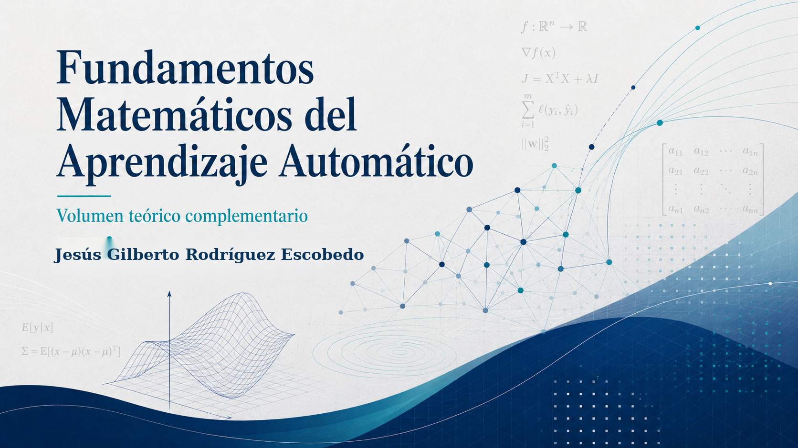

::: {.content-visible when-format="html"}

{.hero-portada-teorico .web-cover-first fig-alt="Portada horizontal del libro Fundamentos Matemáticos del Aprendizaje Automático"}

:::

::: {.content-visible when-format="html"}

::: {.callout-note appearance="simple" icon="true"}
## Descargar el libro en PDF {.unnumbered}

Puedes descargar la versión completa del libro mediante el botón **PDF** que aparece junto al título o mediante el siguiente enlace:

[Descargar PDF del libro](fundamentos-matematicos-aprendizaje-automatico.pdf){.btn .btn-primary}
:::

:::

# Bienvenida {.unnumbered}

Este libro desarrolla los fundamentos matemáticos de los principales métodos de aprendizaje automático. Su propósito es explicar no solamente cómo se ejecutan los algoritmos, sino por qué funcionan, cuáles son sus supuestos y qué propiedades justifican su utilización.

La obra complementa el libro práctico *Aprendizaje y Clasificación Automática con R*. Ambos volúmenes pueden estudiarse por separado, aunque su lectura conjunta permite conectar la formulación matemática, el algoritmo y su implementación computacional.

## Objetivos generales {.unnumbered}

Al finalizar el libro, el lector podrá:

- representar formalmente problemas de aprendizaje automático;
- comprender los fundamentos algebraicos, probabilísticos y estadísticos de los modelos;
- derivar los principales algoritmos de regresión, clasificación y agrupamiento;
- interpretar funciones de pérdida, criterios de optimización y métodos de regularización;
- analizar supuestos, limitaciones y propiedades de generalización;
- relacionar la teoría matemática con implementaciones en R.
