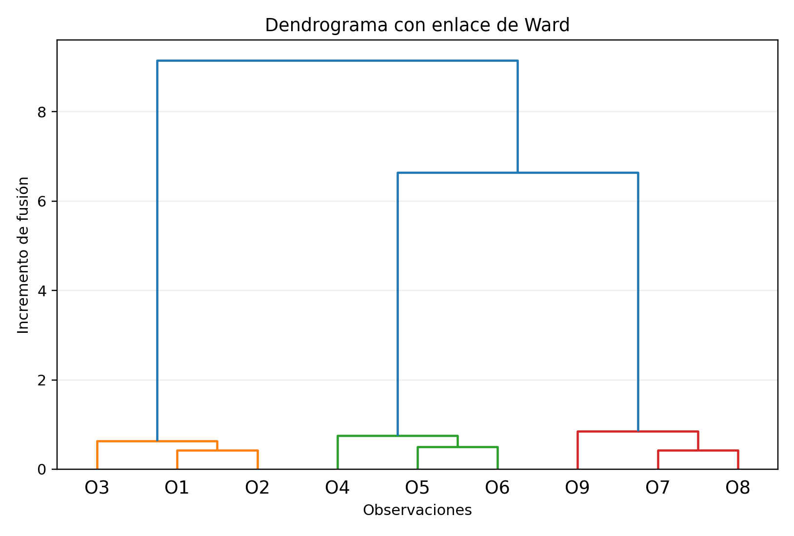

# Agrupamiento jerárquico\index{Agrupamiento jerárquico} {#sec-agrupamiento-jerarquico}

## Introducción {.unnumbered}

El agrupamiento jerárquico construye una sucesión de grupos anidados y representa el resultado mediante un **dendrograma\index{Dendrograma}**. A diferencia de K-means, no exige fijar el número de conglomerados antes de iniciar el análisis.

Existen dos estrategias:

- **aglomerativa:** comienza con una observación por grupo y realiza fusiones;
- **divisiva:** comienza con un solo grupo y realiza separaciones.

El resultado depende de dos decisiones fundamentales: la distancia entre observaciones y el criterio de enlace utilizado para medir distancia entre grupos.

::: {.callout-important title="Definición esencial" appearance="default" icon="true"}
El agrupamiento jerárquico construye una secuencia de particiones anidadas. El dendrograma resume las fusiones, pero su forma depende de la distancia y del criterio de enlace.
:::

## Objetivos {.unnumbered}

Al finalizar el capítulo, el lector podrá:

1. distinguir agrupamiento aglomerativo y divisivo;
2. construir e interpretar una matriz de distancias;
3. definir enlace simple, completo, promedio y Ward\index{Método de Ward};
4. interpretar un dendrograma y sus alturas;
5. seleccionar el número de grupos;
6. calcular distancias cofenéticas;
7. evaluar estabilidad;
8. comparar agrupamiento jerárquico con K-means;
9. reconocer sus ventajas y limitaciones;
10. aplicarlo en R.

## Formulación {.unnumbered}

Considérese una muestra no etiquetada

$$
\mathcal{D}_n=\{\mathbf{x}_1,\ldots,\mathbf{x}_n\},
\qquad
\mathbf{x}_i\in\mathbb{R}^p.
$$

Una partición de las observaciones es una colección

$$
\mathcal{P}=\{C_1,\ldots,C_K\}
$$

tal que

$$
C_k\cap C_\ell=\varnothing
\quad (k\neq \ell),
$$

y

$$
\bigcup_{k=1}^{K}C_k=\{1,\ldots,n\}.
$$

El método jerárquico genera varias particiones relacionadas entre sí.

## Matriz de distancias {.unnumbered}

La información inicial se resume en

$$
\mathbf{D}=(d_{ij}),
$$

donde

$$
d_{ij}=d(\mathbf{x}_i,\mathbf{x}_j).
$$

La matriz satisface

$$
d_{ij}=d_{ji},
\qquad
d_{ii}=0.
$$

## Distancias frecuentes {.unnumbered}

### Euclidiana {.unnumbered}

$$
d_2(\mathbf{x}_i,\mathbf{x}_j)
=
\left[
\sum_{r=1}^{p}(x_{ir}-x_{jr})^2
\right]^{1/2}.
$$

### Manhattan {.unnumbered}

$$
d_1(\mathbf{x}_i,\mathbf{x}_j)
=
\sum_{r=1}^{p}|x_{ir}-x_{jr}|.
$$

### Minkowski {.unnumbered}

$$
d_q(\mathbf{x}_i,\mathbf{x}_j)
=
\left[
\sum_{r=1}^{p}|x_{ir}-x_{jr}|^q
\right]^{1/q}.
$$

Para datos mixtos puede utilizarse la distancia de Gower.

## Escalamiento {.unnumbered}

Cuando las variables tienen escalas distintas, suele emplearse

$$
z_{ij}
=
\frac{x_{ij}-\overline{x}_j}{s_j}.
$$

Sin estandarización, una variable con valores grandes puede dominar las fusiones.

## Agrupamiento aglomerativo {.unnumbered}

El algoritmo inicia con

$$
C_i^{(0)}=\{i\},
\qquad i=1,\ldots,n.
$$

En cada paso se fusionan los dos grupos más cercanos. Después de $n-1$ fusiones queda un solo grupo.

::: {#def-algoritmo-aglomerativo}
1. iniciar con $n$ grupos unitarios;
2. calcular distancias entre grupos;
3. fusionar el par más cercano;
4. actualizar las distancias;
5. repetir hasta formar un único grupo.
:::

## Agrupamiento divisivo {.unnumbered}

El método divisivo inicia con

$$
C^{(0)}=\{1,\ldots,n\}
$$

y divide sucesivamente los grupos. DIANA es un algoritmo divisivo clásico.

## Criterios de enlace {.unnumbered}

Sean $A$ y $B$ dos grupos.

### Enlace simple {.unnumbered}

$$
d_{\text{simple}}(A,B)
=
\min_{i\in A,\;j\in B}
d(\mathbf{x}_i,\mathbf{x}_j).
$$

Detecta estructuras alargadas, pero puede sufrir **encadenamiento**, donde grupos distintos se unen por una cadena de puntos intermedios.

### Enlace completo {.unnumbered}

$$
d_{\text{completo}}(A,B)
=
\max_{i\in A,\;j\in B}
d(\mathbf{x}_i,\mathbf{x}_j).
$$

Favorece grupos compactos, aunque puede ser sensible a valores extremos.

### Enlace promedio {.unnumbered}

$$
d_{\text{promedio}}(A,B)
=
\frac{1}{|A||B|}
\sum_{i\in A}
\sum_{j\in B}
d(\mathbf{x}_i,\mathbf{x}_j).
$$

Representa un compromiso entre enlace simple y completo.

### Enlace por centroides {.unnumbered}

$$
d_{\text{centroide}}(A,B)
=
\|\boldsymbol{\mu}_A-\boldsymbol{\mu}_B\|_2.
$$

Puede producir inversiones en el dendrograma.

## Método de Ward {.unnumbered}

Ward fusiona los grupos que producen el menor aumento en la suma de cuadrados intragrupo.

Para un grupo $C$:

$$
W(C)
=
\sum_{i\in C}
\|\mathbf{x}_i-\boldsymbol{\mu}_C\|_2^2.
$$

El costo de fusionar $A$ y $B$ es

$$
\Delta(A,B)
=
W(A\cup B)-W(A)-W(B).
$$

También puede escribirse como

$$
\Delta(A,B)
=
\frac{|A||B|}{|A|+|B|}
\|\boldsymbol{\mu}_A-\boldsymbol{\mu}_B\|_2^2.
$$

Se fusiona el par con menor incremento.

## Relación entre Ward y K-means {.unnumbered}

Ambos métodos buscan grupos compactos mediante suma de cuadrados.

- K-means optimiza directamente una partición con $K$ fijo.
- Ward construye una jerarquía completa y permite elegir $K$ después.

{#fig-dendrograma-ward width=84% fig-alt="Dendrograma de nueve observaciones construido con enlace de Ward"}

## Dendrograma {.unnumbered}

El dendrograma representa las fusiones:

- el eje horizontal contiene observaciones o ramas;
- el eje vertical muestra la altura de fusión;
- una fusión alta indica mayor diferencia entre grupos.

## Corte del dendrograma {.unnumbered}

Al cortar a una altura $h$, las ramas interceptadas forman los grupos.

Otra opción es fijar directamente el número de grupos:

$$
K.
$$

## Selección del número de grupos {.unnumbered}

Puede utilizarse:

- saltos grandes entre alturas;
- silueta;
- índice Gap;
- estabilidad por remuestreo;
- conocimiento del problema.

La inspección visual debe complementarse con criterios cuantitativos.

## Distancia cofenética {.unnumbered}

La distancia cofenética entre dos observaciones es la altura a la que se fusionan por primera vez.

Se denota por

$$
d_{ij}^{coph}.
$$

## Correlación cofenética {.unnumbered}

Compara las distancias originales con las representadas por el dendrograma:

$$
r_{coph}
=
\operatorname{cor}
\left(
d_{ij},
d_{ij}^{coph}
\right).
$$

Un valor alto indica que el dendrograma conserva bien la estructura de distancias.

La actualización recursiva de distancias puede expresarse mediante la familia de Lance-Williams [@lance1967general]. Esta formulación permite comparar distintos enlaces dentro de una estructura algebraica común.

## Fórmula de Lance-Williams {.unnumbered}

Las distancias pueden actualizarse mediante

$$
d(A\cup B,C)
=
\alpha_A d(A,C)
+
\alpha_B d(B,C)
+
\beta d(A,B)
+
\gamma
|d(A,C)-d(B,C)|.
$$

Los coeficientes dependen del enlace.

Para enlace simple:

$$
\alpha_A=\alpha_B=\frac{1}{2},
\qquad
\beta=0,
\qquad
\gamma=-\frac{1}{2}.
$$

Para enlace completo:

$$
\alpha_A=\alpha_B=\frac{1}{2},
\qquad
\beta=0,
\qquad
\gamma=\frac{1}{2}.
$$

## Inversiones {.unnumbered}

Una inversión ocurre cuando una fusión posterior aparece a menor altura que una anterior. Puede presentarse con el enlace por centroides y dificulta la interpretación.

## Estabilidad {.unnumbered}

Una solución es estable si pequeñas perturbaciones producen grupos semejantes.

Puede evaluarse mediante:

- bootstrap;
- submuestreo;
- comparación de dendrogramas;
- coeficiente de Jaccard;
- índice de Rand ajustado.

## Jaccard de grupos {.unnumbered}

Para un grupo original $C$ y uno remuestreado $C^*$:

$$
J(C,C^*)
=
\frac{|C\cap C^*|}{|C\cup C^*|}.
$$

Valores altos indican estabilidad.

## Comparación de dendrogramas {.unnumbered}

Pueden utilizarse:

- correlación cofenética;
- tanglegrams;
- entanglement;
- comparación de ramas.

Los algoritmos jerárquicos clásicos son apropiados sobre todo para muestras pequeñas o medianas. Revisiones modernas describen variantes eficientes y los compromisos entre exactitud, memoria y tiempo [@murtagh2012algorithms].

## Complejidad computacional {.unnumbered}

La matriz de distancias requiere memoria del orden de

$$
O(n^2).
$$

El tiempo puede variar entre

$$
O(n^2)
$$

y

$$
O(n^3),
$$

dependiendo del algoritmo.

Esto limita el método en muestras muy grandes.

## Métodos escalables {.unnumbered}

Para grandes volúmenes pueden utilizarse:

- muestreo;
- preagrupamiento;
- aproximaciones;
- BIRCH;
- clustering híbrido.

## Valores atípicos {.unnumbered}

Una observación extrema puede:

- formar una rama aislada;
- aumentar las alturas;
- cambiar fusiones posteriores;
- distorsionar el número de grupos.

Debe analizarse antes de interpretar el dendrograma.

## Variables categóricas y mixtas {.unnumbered}

La distancia euclidiana no es adecuada directamente para variables categóricas.

Pueden utilizarse:

- Gower;
- Jaccard;
- coincidencia simple;
- transformaciones apropiadas.

## Distancia de Jaccard {.unnumbered}

Para presencia o ausencia:

$$
d_J(A,B)
=
1-
\frac{|A\cap B|}{|A\cup B|}.
$$

Es útil cuando la presencia es más informativa que la ausencia.

## Visualización {.unnumbered}

Además del dendrograma:

- heatmap con dendrogramas;
- proyección PCA;
- gráficos de silueta;
- perfiles de grupos;
- tanglegrams.

## Relación con grafos {.unnumbered}

El enlace simple está relacionado con el árbol de expansión mínima. Cortar sus aristas más largas puede producir la misma partición que un corte del dendrograma de enlace simple.

## Comparación con K-means {.unnumbered}

| Aspecto | Jerárquico | K-means |
|---|---|---|
| Resultado | Jerarquía | Una partición |
| Número de grupos | Puede elegirse después | Se fija antes |
| Distancias | Variadas | Euclidiana cuadrática |
| Escalabilidad | Menor | Mayor |
| Forma de grupos | Depende del enlace | Compactos y esféricos |
| Reversibilidad | Fusiones irreversibles | Reasignaciones iterativas |

## Comparación con DBSCAN {.unnumbered}

DBSCAN detecta grupos por densidad y puede identificar ruido. El agrupamiento jerárquico produce una jerarquía completa, pero no identifica ruido de manera natural.

## Conexión con R {.unnumbered}

```{r}
#| eval: false
#| label: lst-jerarquico-r
#| lst-cap: "Dendrograma, corte y correlación cofenética en R"
#| code-line-numbers: true
#| code-overflow: wrap

datos <- data.frame(
  pm10 = c(45, 52, 60, 38, 70, 65, 30, 28),
  no2 = c(30, 35, 42, 28, 50, 47, 20, 18),
  temperatura = c(22, 24, 26, 20, 28, 27, 18, 17),
  humedad = c(60, 55, 50, 70, 45, 48, 75, 78)
)

datos_esc <- scale(datos)

distancias <- dist(
  datos_esc,
  method = "euclidean"
)

modelo_completo <- hclust(
  distancias,
  method = "complete"
)

plot(
  modelo_completo,
  main = "Agrupamiento jerárquico",
  xlab = "",
  sub = ""
)

grupos <- cutree(
  modelo_completo,
  k = 3
)

grupos

modelo_ward <- hclust(
  distancias,
  method = "ward.D2"
)

plot(modelo_ward)

dist_coph <- cophenetic(modelo_ward)

cor(
  as.vector(distancias),
  as.vector(dist_coph)
)
```

## Ejemplo numérico {.unnumbered}

Considérese:

$$
1,\;2,\;5,\;9.
$$

La primera fusión ocurre entre 1 y 2 porque

$$
d(1,2)=1.
$$

Con enlace simple, la distancia entre $\{1,2\}$ y $\{5\}$ es

$$
\min\{4,3\}=3.
$$

## Ejemplo de enlaces {.unnumbered}

Sean

$$
A=\{1,2\},
\qquad
B=\{5,9\}.
$$

Las distancias cruzadas son

$$
4,\;8,\;3,\;7.
$$

Por tanto:

$$
d_{\text{simple}}(A,B)=3,
$$

$$
d_{\text{completo}}(A,B)=8,
$$

$$
d_{\text{promedio}}(A,B)
=
\frac{4+8+3+7}{4}
=
5.5.
$$

## Ejemplo de Ward {.unnumbered}

Sean

$$
|A|=3,
\qquad
|B|=2,
$$

y

$$
\|\boldsymbol{\mu}_A-\boldsymbol{\mu}_B\|_2=4.
$$

Entonces

$$
\Delta(A,B)
=
\frac{3(2)}{3+2}(4^2)
=
19.2.
$$

## Seudocódigo formal {.unnumbered}

::: {.callout-note title="Seudocódigo matemático formal" appearance="default" icon="true"}
```text
Algoritmo Jerárquico-Aglomerativo
Entrada:
  observaciones {x_i}_{i=1}^n y una distancia d
Salida:
  dendrograma

1. Inicializar n grupos:
      C_i^{(0)} = {x_i},   i=1,...,n.
2. Calcular la matriz de distancias entre grupos.
3. Para t = 0,1,...,n-2:
   a) Encontrar los grupos más próximos
         (C_r^{(t)}, C_s^{(t)}).
   b) Fusionarlos:
         C_u^{(t+1)} = C_r^{(t)} ∪ C_s^{(t)}.
   c) Actualizar las distancias entre C_u^{(t+1)} y los demás grupos
      según el criterio de enlace seleccionado.
4. Registrar cada fusión y su altura.
5. Devolver el dendrograma y la secuencia de particiones.
```
:::

## Ventajas {.unnumbered}

1. produce una jerarquía completa;
2. no exige fijar $K$ inicialmente;
3. admite distintas métricas;
4. proporciona una visualización interpretativa;
5. detecta estructuras anidadas;
6. puede trabajar con datos mixtos usando distancias adecuadas.

## Limitaciones {.unnumbered}

1. costo elevado;
2. sensibilidad a escala;
3. sensibilidad a valores atípicos;
4. dependencia del enlace;
5. fusiones irreversibles;
6. selección del corte potencialmente subjetiva;
7. dificultad con muestras grandes.

## Errores frecuentes {.unnumbered}

1. no estandarizar;
2. elegir el enlace sin justificarlo;
3. interpretar el dendrograma como una verdad única;
4. ignorar valores extremos;
5. usar Euclidiana con variables mixtas;
6. seleccionar grupos solo visualmente;
7. no evaluar estabilidad;
8. confundir altura de fusión con tamaño;
9. interpretar etiquetas como ordenadas;
10. inferir causalidad a partir de los grupos.

## Ejercicios conceptuales {.unnumbered}

1. Compare métodos aglomerativos y divisivos.
2. ¿Qué representa el dendrograma?
3. Explique enlace simple, completo y promedio.
4. ¿Qué es el encadenamiento?
5. ¿Por qué Ward se relaciona con K-means?
6. ¿Qué representa la altura de fusión?
7. ¿Qué es la distancia cofenética?
8. ¿Cómo se selecciona el número de grupos?
9. ¿Por qué afectan los valores atípicos?
10. Compare agrupamiento jerárquico y K-means.

## Ejercicio de distancias {.unnumbered}

Considere

$$
(1,1),\;(2,1),\;(5,4),\;(6,5).
$$

1. Calcule la matriz euclidiana.
2. Identifique la primera fusión.
3. Continúe con enlace simple.
4. Repita con enlace completo.
5. Compare los resultados.

## Ejercicio de Ward {.unnumbered}

Considere

$$
|A|=4,
\qquad
|B|=6,
$$

y

$$
\|\boldsymbol{\mu}_A-\boldsymbol{\mu}_B\|_2^2=9.
$$

Calcule el incremento de Ward.

## Ejercicio aplicado {.unnumbered}

Agrupe estaciones de calidad del aire utilizando:

- PM10;
- PM2.5;
- NO2;
- ozono;
- temperatura;
- humedad;
- viento.

Incluya:

1. limpieza;
2. faltantes;
3. valores atípicos;
4. estandarización;
5. elección de distancia;
6. comparación de enlaces;
7. dendrogramas;
8. correlación cofenética;
9. selección de grupos;
10. silueta;
11. estabilidad por bootstrap;
12. perfiles;
13. comparación con K-means;
14. limitaciones ambientales.

## Resumen {.unnumbered}

En este capítulo se desarrolló el agrupamiento jerárquico como método para construir grupos anidados.

Se estudiaron los enfoques aglomerativo y divisivo, las matrices de distancia, los enlaces simple, completo, promedio, por centroides y Ward.

También se analizaron dendrogramas, alturas, cortes, distancias cofenéticas, fórmula de Lance-Williams, estabilidad, valores atípicos, complejidad y comparación con K-means.

## Referencias del capítulo {.unnumbered}

Los fundamentos se apoyan en @ward1963hierarchical, @lance1967general, @murtagh2012algorithms y @mardia1979multivariate.
