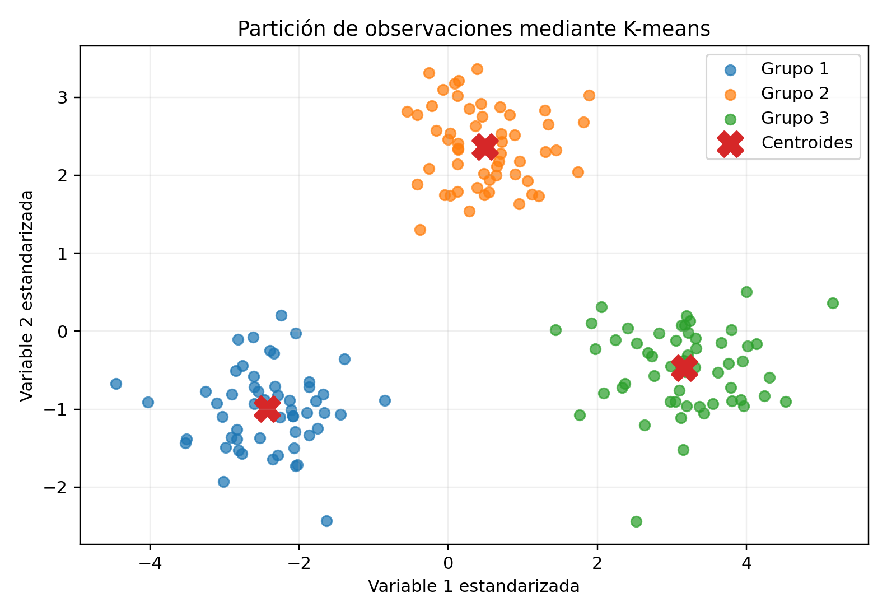

# Agrupamiento mediante K-means\index{K-means} {#sec-kmeans}

## Introducción {.unnumbered}

K-means es uno de los algoritmos más conocidos de aprendizaje no supervisado. Su objetivo consiste en dividir un conjunto de observaciones en $K$ grupos de manera que las observaciones dentro de cada grupo sean lo más semejantes posible y los grupos entre sí sean diferentes.

El método representa cada grupo mediante un centroide\index{Centroides}. La asignación de observaciones y la actualización de centroides se realizan de forma iterativa hasta alcanzar una solución estable.

K-means es conceptualmente sencillo, computacionalmente eficiente y ampliamente utilizado en segmentación, compresión, análisis exploratorio y preprocesamiento. Sin embargo, su desempeño depende de la escala de las variables, de la inicialización, de la forma de los grupos y de la elección del número de conglomerados.

::: {.callout-important title="Definición esencial" appearance="default" icon="true"}
K-means divide las observaciones en $K$ grupos y representa cada grupo por su media. El algoritmo alterna asignaciones y actualización de centroides para reducir la suma de cuadrados intragrupo.
:::

## Objetivos {.unnumbered}

Al finalizar el capítulo, el lector podrá:

1. formular el problema de agrupamiento;
2. definir centroides y asignaciones;
3. derivar la función objetivo de K-means;
4. comprender el algoritmo de Lloyd;
5. demostrar la disminución monótona de la función objetivo;
6. interpretar la convergencia local;
7. analizar el efecto de la inicialización;
8. comprender K-means++;
9. seleccionar el número de grupos;
10. interpretar inercia, silueta\index{Silueta} y separación;
11. reconocer limitaciones geométricas;
12. analizar sensibilidad a escala y valores atípicos;
13. relacionar K-means con mezcla de gaussianas;
14. aplicar el método en R.

## Formulación del problema {.unnumbered}

Considérese una muestra no etiquetada

$$
\mathcal{D}_n
=
\left\{
\mathbf{x}_1,\ldots,\mathbf{x}_n
\right\},
$$

donde

$$
\mathbf{x}_i\in\mathbb{R}^{p}.
$$

Se desea dividir las observaciones en $K$ grupos:

$$
C_1,\ldots,C_K.
$$

Estos grupos deben formar una partición:

$$
C_k\cap C_\ell=\varnothing,
\qquad k\neq \ell,
$$

y

$$
\bigcup_{k=1}^{K}C_k
=
\{1,\ldots,n\}.
$$

## Centroides {.unnumbered}

El centroide del grupo $C_k$ es

$$
\boldsymbol{\mu}_k
=
\frac{1}{|C_k|}
\sum_{i\in C_k}
\mathbf{x}_i.
$$

Cada centroide representa la media vectorial de las observaciones asignadas al grupo.

{#fig-kmeans-centroides width=82% fig-alt="Tres grupos de puntos y sus centroides"}

## Función objetivo {.unnumbered}

K-means minimiza la suma de cuadrados dentro de los grupos:

$$
J
=
\sum_{k=1}^{K}
\sum_{i\in C_k}
\left\|
\mathbf{x}_i-\boldsymbol{\mu}_k
\right\|_2^2.
$$

Esta cantidad también se conoce como:

- inercia;
- suma de cuadrados intragrupo;
- within-cluster sum of squares.

## Variables indicadoras {.unnumbered}

Defínase

$$
r_{ik}
=
\begin{cases}
1, & \mathbf{x}_i\in C_k,\\
0, & \text{en otro caso}.
\end{cases}
$$

Entonces

$$
\sum_{k=1}^{K}r_{ik}=1
$$

para toda observación $i$.

La función objetivo puede escribirse como

$$
J(\mathbf{R},\boldsymbol{\mu})
=
\sum_{i=1}^{n}
\sum_{k=1}^{K}
r_{ik}
\left\|
\mathbf{x}_i-\boldsymbol{\mu}_k
\right\|_2^2.
$$

## Optimización alternante {.unnumbered}

El problema es difícil de resolver globalmente porque las asignaciones son discretas.

K-means utiliza optimización alternante:

1. fijar centroides y optimizar asignaciones;
2. fijar asignaciones y optimizar centroides;
3. repetir.

## Paso de asignación {.unnumbered}

Dados los centroides, cada observación se asigna al centroide más cercano:

$$
r_{ik}
=
\begin{cases}
1, &
k=
\operatorname*{arg\,min}_{\ell}
\left\|
\mathbf{x}_i-\boldsymbol{\mu}_{\ell}
\right\|_2^2,\\
0, & \text{en otro caso}.
\end{cases}
$$

## Paso de actualización {.unnumbered}

Dadas las asignaciones, el centroide óptimo es la media:

$$
\boldsymbol{\mu}_k
=
\frac{
\sum_{i=1}^{n}
r_{ik}\mathbf{x}_i
}{
\sum_{i=1}^{n}r_{ik}
}.
$$

## Derivación del centroide {.unnumbered}

Para un grupo fijo, se minimiza

$$
J_k(\boldsymbol{\mu}_k)
=
\sum_{i\in C_k}
\left\|
\mathbf{x}_i-\boldsymbol{\mu}_k
\right\|_2^2.
$$

Derivando:

$$
\nabla_{\boldsymbol{\mu}_k}J_k
=
-2
\sum_{i\in C_k}
\left(
\mathbf{x}_i-\boldsymbol{\mu}_k
\right).
$$

Igualando a cero:

$$
\sum_{i\in C_k}\mathbf{x}_i
=
|C_k|\boldsymbol{\mu}_k.
$$

Por tanto,

$$
\boldsymbol{\mu}_k
=
\frac{1}{|C_k|}
\sum_{i\in C_k}\mathbf{x}_i.
$$

La formulación moderna de K-means se relaciona con los trabajos de @macqueen1967some y @lloyd1982least. Cada paso reduce o mantiene la función objetivo, pero la solución final depende de la inicialización.

## Algoritmo de Lloyd {.unnumbered}

::: {#def-algoritmo-lloyd}
El algoritmo clásico de K-means es:

1. seleccionar $K$ centroides iniciales;
2. asignar cada observación al centroide más cercano;
3. recalcular cada centroide como la media de su grupo;
4. repetir hasta que las asignaciones o centroides dejen de cambiar.
:::

## Pseudocódigo {.unnumbered}

Dado $K$:

1. inicializar $\boldsymbol{\mu}_1,\ldots,\boldsymbol{\mu}_K$;
2. para cada $i$, asignar $\mathbf{x}_i$ al centroide más cercano;
3. actualizar cada $\boldsymbol{\mu}_k$;
4. calcular $J$;
5. detener si la reducción de $J$ es menor que una tolerancia;
6. de otro modo, volver al paso 2.

## Convergencia {.unnumbered}

Cada paso de asignación no aumenta la función objetivo.

Cada paso de actualización tampoco aumenta la función objetivo.

Por tanto,

$$
J^{(t+1)}
\leq
J^{(t)}.
$$

Como $J\geq 0$, la secuencia converge.

## Convergencia local {.unnumbered}

La convergencia no garantiza alcanzar el mínimo global.

K-means puede quedar atrapado en un mínimo local dependiendo de:

- centroides iniciales;
- estructura de los datos;
- número de grupos;
- presencia de valores atípicos.

## Inicialización aleatoria {.unnumbered}

Una estrategia simple consiste en seleccionar aleatoriamente $K$ observaciones como centroides.

Esta estrategia puede producir:

- grupos vacíos;
- soluciones pobres;
- alta variabilidad entre ejecuciones.

## Reinicios múltiples {.unnumbered}

Para reducir dependencia de la inicialización:

1. ejecutar K-means varias veces;
2. calcular la función objetivo final;
3. conservar la solución con menor valor de $J$.

En R, este comportamiento se controla con `nstart`.

## K-means++ {.unnumbered}

K-means++ mejora la selección inicial:

1. seleccionar el primer centroide al azar;
2. calcular la distancia de cada observación al centroide más cercano ya elegido;
3. seleccionar el siguiente centroide con probabilidad proporcional al cuadrado de esa distancia;
4. repetir hasta obtener $K$ centroides.

Esto favorece centroides iniciales bien separados.

## Cota de K-means++ {.unnumbered}

K-means++ proporciona una garantía esperada de aproximación del orden de

$$
O(\log K)
$$

respecto del óptimo global.

## Distancia euclidiana {.unnumbered}

K-means está ligado a la distancia euclidiana cuadrática:

$$
d^2(\mathbf{x},\boldsymbol{\mu})
=
\left\|
\mathbf{x}-\boldsymbol{\mu}
\right\|_2^2.
$$

Cambiar la distancia requiere modificar también la definición del representante del grupo.

## Relación entre media y distancia cuadrática {.unnumbered}

La media es el punto que minimiza la suma de distancias euclidianas cuadráticas.

Por ello, K-means no puede reemplazar arbitrariamente la distancia euclidiana por otra sin cambiar el algoritmo.

## K-medians {.unnumbered}

Si se utiliza distancia Manhattan, el representante adecuado es la mediana.

El método resultante se denomina K-medians.

## K-medoids {.unnumbered}

K-medoids representa cada grupo mediante una observación real del conjunto.

Es más robusto frente a valores atípicos y permite distancias más generales.

## Geometría de los grupos {.unnumbered}

K-means funciona mejor cuando los grupos son:

- aproximadamente esféricos;
- de tamaño semejante;
- de densidad semejante;
- bien separados;
- describibles mediante centroides.

## Regiones de Voronoi {.unnumbered}

Dados los centroides, el espacio se divide en regiones:

$$
V_k
=
\left\{
\mathbf{x}:
\left\|
\mathbf{x}-\boldsymbol{\mu}_k
\right\|_2
\leq
\left\|
\mathbf{x}-\boldsymbol{\mu}_\ell
\right\|_2
\text{ para todo }\ell
\right\}.
$$

Cada región es una celda de Voronoi.

## Fronteras entre grupos {.unnumbered}

La frontera entre dos centroides satisface

$$
\left\|
\mathbf{x}-\boldsymbol{\mu}_k
\right\|_2^2
=
\left\|
\mathbf{x}-\boldsymbol{\mu}_\ell
\right\|_2^2.
$$

Al simplificar, se obtiene un hiperplano.

## Escalamiento {.unnumbered}

K-means depende fuertemente de la escala.

Si una variable tiene varianza muy grande, dominará la función objetivo.

Por ello, suele utilizarse estandarización:

$$
z_{ij}
=
\frac{x_{ij}-\overline{x}_j}{s_j}.
$$

## Valores atípicos {.unnumbered}

La media y la distancia cuadrática son sensibles a valores extremos.

Un valor atípico puede:

- desplazar centroides;
- formar un grupo aislado;
- alterar asignaciones;
- aumentar la inercia.

## Grupos vacíos {.unnumbered}

Durante una actualización, un grupo puede quedar sin observaciones.

Estrategias:

- reinicializar el centroide;
- usar una observación alejada;
- dividir el grupo con mayor dispersión;
- reiniciar el algoritmo.

## Elección del número de grupos {.unnumbered}

El valor de $K$ es un hiperparámetro.

No existe un criterio universal.

Se utilizan:

- método del codo;
- silueta;
- índice Gap;
- estabilidad;
- conocimiento del dominio;
- desempeño posterior.

## Método del codo {.unnumbered}

Se calcula

$$
W_K
=
\sum_{k=1}^{K}
\sum_{i\in C_k}
\left\|
\mathbf{x}_i-\boldsymbol{\mu}_k
\right\|_2^2.
$$

Como $W_K$ disminuye al aumentar $K$, se busca un punto donde la mejora adicional se vuelve pequeña.

El coeficiente de silueta combina compactación y separación y permite comparar particiones con distintos valores de $K$ [@rousseeuw1987silhouettes]. No reemplaza la interpretación sustantiva ni la evaluación de estabilidad.

## Coeficiente de silueta {.unnumbered}

Para la observación $i$:

- $a(i)$ es la distancia promedio dentro de su grupo;
- $b(i)$ es la menor distancia promedio a otro grupo.

La silueta es

$$
s(i)
=
\frac{
b(i)-a(i)
}{
\max\{a(i),b(i)\}
}.
$$

Se cumple

$$
-1\leq s(i)\leq 1.
$$

## Interpretación de la silueta {.unnumbered}

- valor cercano a 1: buena asignación;
- valor cercano a 0: observación en frontera;
- valor negativo: posible asignación incorrecta.

La silueta promedio resume la calidad global.

## Índice Gap {.unnumbered}

El índice Gap compara la dispersión observada con la esperada bajo una distribución de referencia sin estructura de grupos.

Se selecciona un valor de $K$ cuya mejora sea significativa respecto del caso aleatorio.

## Estabilidad del agrupamiento {.unnumbered}

Un agrupamiento es estable si pequeñas modificaciones en los datos producen grupos semejantes.

Puede evaluarse mediante:

- bootstrap;
- submuestreo;
- perturbaciones;
- índices de concordancia.

## Índice de Rand ajustado {.unnumbered}

Si se comparan dos particiones, el índice de Rand ajustado mide su concordancia corrigiendo el acuerdo esperado por azar.

Su valor máximo es 1.

## Evaluación sin etiquetas {.unnumbered}

Sin etiquetas verdaderas se utilizan criterios internos:

- inercia;
- silueta;
- separación;
- compactación;
- estabilidad.

## Evaluación con etiquetas externas {.unnumbered}

Si existen etiquetas de referencia, pueden utilizarse:

- Rand ajustado;
- información mutua normalizada;
- pureza;
- homogeneidad;
- completitud.

Las etiquetas no intervienen en el ajuste, solo en la evaluación.

## Relación con mezcla de gaussianas {.unnumbered}

K-means puede interpretarse como un caso límite de una mezcla de gaussianas con:

- covarianzas esféricas;
- igual varianza;
- asignación dura;
- probabilidades uniformes.

## Mezclas gaussianas {.unnumbered}

Una mezcla gaussiana modela

$$
p(\mathbf{x})
=
\sum_{k=1}^{K}
\pi_k
\mathcal{N}
\left(
\mathbf{x}
\mid
\boldsymbol{\mu}_k,
\boldsymbol{\Sigma}_k
\right).
$$

A diferencia de K-means, produce asignaciones probabilísticas.

## Asignación dura y blanda {.unnumbered}

K-means usa

$$
r_{ik}\in\{0,1\}.
$$

Una mezcla gaussiana usa responsabilidades

$$
0\leq\gamma_{ik}\leq 1,
$$

con

$$
\sum_{k=1}^{K}\gamma_{ik}=1.
$$

## K-means como cuantización vectorial {.unnumbered}

K-means puede utilizarse para representar cada observación mediante su centroide más cercano.

Esto se denomina cuantización vectorial.

Aplicaciones:

- compresión de imágenes;
- reducción de colores;
- diccionarios visuales;
- compresión de señales.

## K-means en imágenes {.unnumbered}

Cada píxel puede representarse por un vector RGB.

K-means agrupa colores y reemplaza cada píxel por el color de su centroide.

## K-means en datos grandes {.unnumbered}

Para grandes volúmenes se utiliza mini-batch K-means.

En cada iteración se actualizan centroides con un subconjunto pequeño de observaciones.

## Mini-batch K-means {.unnumbered}

Reduce el costo computacional y permite trabajar con datos masivos.

Puede sacrificar algo de precisión a cambio de velocidad.

## Complejidad computacional {.unnumbered}

El costo aproximado por iteración es

$$
O(nKp).
$$

Si se realizan $T$ iteraciones:

$$
O(nKpT).
$$

## Memoria {.unnumbered}

La implementación básica necesita almacenar:

- la matriz de datos;
- los centroides;
- las asignaciones;
- distancias temporales.

## Datos categóricos {.unnumbered}

K-means no es adecuado directamente para variables categóricas.

Alternativas:

- K-modes;
- K-prototypes;
- distancias de Gower;
- clustering jerárquico.

## K-modes {.unnumbered}

K-modes utiliza:

- moda como representante;
- discrepancia categórica;
- datos nominales.

## K-prototypes {.unnumbered}

K-prototypes combina:

- medias para variables numéricas;
- modas para categóricas;
- una función de costo mixta.

## Reducción de dimensionalidad previa {.unnumbered}

PCA puede aplicarse antes de K-means para:

- reducir ruido;
- disminuir costo;
- facilitar visualización;
- mitigar correlación.

Pero también puede eliminar componentes importantes para separar grupos.

## Fuga de información {.unnumbered}

En un análisis predictivo posterior, cualquier escalamiento o PCA debe aprenderse con los datos de entrenamiento.

En clustering puramente exploratorio, debe documentarse claramente el conjunto utilizado.

## Interpretación de centroides {.unnumbered}

Los centroides pueden describirse mediante perfiles:

$$
\boldsymbol{\mu}_k
=
\begin{pmatrix}
\mu_{k1}\\
\vdots\\
\mu_{kp}
\end{pmatrix}.
$$

Cada componente representa la media de una variable dentro del grupo.

## Etiquetas de los grupos {.unnumbered}

Los números de grupo son arbitrarios.

Cambiar las etiquetas no cambia la solución.

Por ejemplo, los grupos 1 y 2 pueden intercambiarse sin modificar la partición.

## No identificabilidad de etiquetas {.unnumbered}

Este fenómeno se conoce como permutación de etiquetas.

La interpretación debe basarse en centroides y características, no en el número asignado.

## Sensibilidad al orden {.unnumbered}

Una implementación determinista con inicialización fija no depende del orden.

Sin embargo, algoritmos en línea o mini-batch pueden verse afectados por el orden de llegada.

## Reproducibilidad {.unnumbered}

Debe fijarse una semilla aleatoria y reportarse:

- número de reinicios;
- método de inicialización;
- valor de $K$;
- escalamiento;
- criterio de selección.

## Conexión con R {.unnumbered}

```{r}
#| eval: false
#| label: lst-kmeans-r
#| lst-cap: "Agrupamiento K-means y método del codo en R"
#| code-line-numbers: true
#| code-overflow: wrap

datos <- data.frame(
  pm10 = c(45, 52, 60, 38, 70, 65, 30, 28),
  no2 = c(30, 35, 42, 28, 50, 47, 20, 18),
  temperatura = c(22, 24, 26, 20, 28, 27, 18, 17),
  humedad = c(60, 55, 50, 70, 45, 48, 75, 78)
)

datos_esc <- scale(datos)

set.seed(123)

modelo <- kmeans(
  datos_esc,
  centers = 3,
  nstart = 50,
  iter.max = 100
)

modelo$cluster
modelo$centers
modelo$tot.withinss
modelo$betweenss
modelo$size

# Método del codo
wss <- sapply(1:8, function(k) {
  kmeans(
    datos_esc,
    centers = k,
    nstart = 30
  )$tot.withinss
})

plot(
  1:8,
  wss,
  type = "b",
  xlab = "Número de grupos",
  ylab = "Suma de cuadrados intragrupo"
)
```

## Ejemplo numérico {.unnumbered}

Considérese el conjunto unidimensional:

$$
1,\;2,\;3,\;8,\;9,\;10.
$$

Con $K=2$ y centroides iniciales

$$
\mu_1=2,
\qquad
\mu_2=9,
$$

las asignaciones son:

$$
C_1=\{1,2,3\},
$$

$$
C_2=\{8,9,10\}.
$$

Los centroides actualizados son

$$
\mu_1
=
\frac{1+2+3}{3}
=
2,
$$

$$
\mu_2
=
\frac{8+9+10}{3}
=
9.
$$

El algoritmo converge inmediatamente.

## Ejemplo de función objetivo {.unnumbered}

Para el primer grupo:

$$
(1-2)^2+(2-2)^2+(3-2)^2=2.
$$

Para el segundo:

$$
(8-9)^2+(9-9)^2+(10-9)^2=2.
$$

Por tanto,

$$
J=4.
$$

## Ejemplo de sensibilidad a escala {.unnumbered}

Supóngase que una variable se mide entre 0 y 1 y otra entre 0 y 10000.

Sin estandarización, la segunda variable dominará la distancia.

Esto puede producir grupos definidos casi exclusivamente por ella.

::: {.callout-warning title="El agrupamiento no descubre automáticamente grupos verdaderos" appearance="default" icon="true"}
Un algoritmo siempre puede producir una partición cuando se le solicita. La existencia matemática de grupos no implica que estos sean estables, naturales o útiles. El resultado debe evaluarse mediante geometría, estabilidad y conocimiento del dominio [@jain2010clustering].
:::

## Seudocódigo formal {.unnumbered}

::: {.callout-note title="Seudocódigo matemático formal" appearance="default" icon="true"}
```text
Algoritmo K-means
Entrada:
  X = {x_i}_{i=1}^n ⊂ ℝ^p, número de grupos K
Salida:
  partición {C_1,...,C_K} y centroides {μ_1,...,μ_K}

1. Inicializar centroides μ_1^{(0)},...,μ_K^{(0)}.
2. Repetir hasta convergencia:
   a) Asignación:
         C_k^{(t)} = {x_i : ||x_i - μ_k^{(t)}||^2 ≤ ||x_i - μ_\ell^{(t)}||^2, ∀\ell }.
   b) Actualización:
         μ_k^{(t+1)} = (1/|C_k^{(t)}|)\sum_{x_i∈C_k^{(t)}} x_i.
3. Detener cuando no cambian las asignaciones o la reducción en la función objetivo es despreciable.
4. Devolver la partición final y los centroides.
```
:::

## Ventajas {.unnumbered}

1. sencillo;
2. eficiente;
3. escalable;
4. fácil de implementar;
5. útil para exploración;
6. centroides interpretables;
7. apropiado para grupos compactos y esféricos.

## Limitaciones {.unnumbered}

1. requiere elegir $K$;
2. depende de inicialización;
3. converge a mínimos locales;
4. sensible a escala;
5. sensible a valores atípicos;
6. no maneja bien grupos no convexos;
7. supone estructura aproximadamente esférica;
8. no es adecuado directamente para datos categóricos.

## Errores frecuentes {.unnumbered}

1. no estandarizar;
2. usar un solo inicio;
3. elegir $K$ solo por intuición;
4. interpretar etiquetas como ordenadas;
5. asumir que los grupos son verdaderos o naturales;
6. usar K-means con variables categóricas;
7. ignorar valores atípicos;
8. usar el codo como criterio único;
9. confundir compactación con utilidad práctica;
10. concluir causalidad a partir de grupos.

## Ejercicios conceptuales {.unnumbered}

1. Explique la función objetivo de K-means.
2. ¿Por qué el centroide es la media?
3. ¿Por qué el algoritmo disminuye la función objetivo?
4. ¿Por qué no garantiza el óptimo global?
5. ¿Qué función cumple K-means++?
6. ¿Por qué es importante estandarizar?
7. ¿Qué representa la silueta?
8. Compare K-means y K-medoids.
9. ¿Qué relación existe con mezclas gaussianas?
10. ¿Por qué las etiquetas de grupos son arbitrarias?
11. ¿Qué ocurre con grupos no esféricos?
12. ¿Cómo se evalúa estabilidad?

## Ejercicio de asignación {.unnumbered}

Considere los puntos

$$
(1,1),\;(2,1),\;(5,4),\;(6,5)
$$

y centroides iniciales

$$
\boldsymbol{\mu}_1=(1,1),
\qquad
\boldsymbol{\mu}_2=(6,5).
$$

1. Calcule las distancias.
2. Asigne cada punto.
3. Recalcule los centroides.
4. Calcule la función objetivo.

## Ejercicio de centroides {.unnumbered}

Los puntos de un grupo son

$$
(2,1),\;(4,3),\;(6,5).
$$

1. Calcule el centroide.
2. Calcule la suma de cuadrados respecto del centroide.
3. Compare con el punto $(3,3)$ como representante.

## Ejercicio de silueta {.unnumbered}

Para una observación:

$$
a(i)=2.5,
\qquad
b(i)=6.
$$

1. Calcule $s(i)$.
2. Interprete el resultado.

Repita con:

$$
a(i)=5,
\qquad
b(i)=4.
$$

## Ejercicio del codo {.unnumbered}

Se obtiene:

| $K$ | Inercia |
|---:|---:|
| 1 | 950 |
| 2 | 520 |
| 3 | 290 |
| 4 | 230 |
| 5 | 200 |
| 6 | 185 |

1. Grafique conceptualmente la curva.
2. Proponga un valor de $K$.
3. Justifique la elección.
4. Explique por qué el criterio no es concluyente.

## Ejercicio aplicado {.unnumbered}

Se desea agrupar estaciones de calidad del aire usando:

- PM10;
- PM2.5;
- NO2;
- ozono;
- temperatura;
- humedad;
- viento.

Diseñe un análisis que incluya:

1. limpieza;
2. manejo de faltantes;
3. valores atípicos;
4. estandarización;
5. selección de $K$;
6. reinicios múltiples;
7. K-means++;
8. silueta;
9. estabilidad;
10. interpretación de centroides;
11. visualización con PCA;
12. comparación con clustering jerárquico;
13. análisis temporal;
14. limitaciones ambientales.

## Resumen {.unnumbered}

En este capítulo se desarrolló K-means como método de agrupamiento basado en centroides.

Se formuló la función objetivo, se derivó la media como centroide óptimo y se explicó el algoritmo de Lloyd mediante pasos alternantes de asignación y actualización.

También se analizaron convergencia local, inicialización, K-means++, selección de $K$, método del codo, silueta, índice Gap, estabilidad y complejidad computacional.

Finalmente, se estudiaron sensibilidad a escala, valores atípicos, grupos no esféricos, relación con mezclas gaussianas, cuantización vectorial y variantes para datos grandes o mixtos.

## Referencias del capítulo {.unnumbered}

Los fundamentos se apoyan en @macqueen1967some, @lloyd1982least, @arthur2007kmeans, @rousseeuw1987silhouettes y @jain2010clustering.
