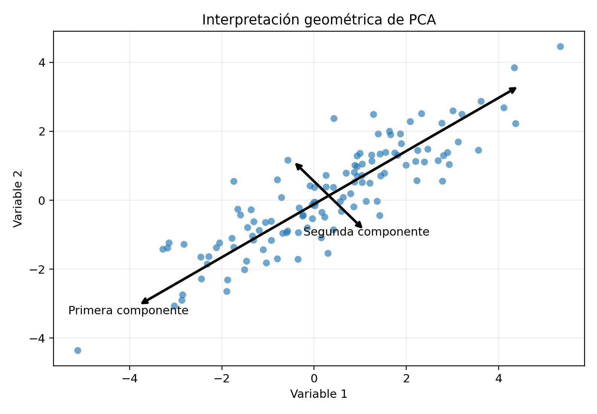

# Análisis de Componentes Principales\index{Análisis de componentes principales}, PCA {#sec-pca}

## Introducción {.unnumbered}

El Análisis de Componentes Principales, conocido como PCA por *Principal Component Analysis*, es uno de los métodos más importantes de reducción de dimensionalidad.

Su objetivo consiste en transformar un conjunto de variables posiblemente correlacionadas en un nuevo conjunto de variables no correlacionadas llamadas componentes principales. Estas componentes se ordenan de acuerdo con la cantidad de variabilidad que explican.

PCA no utiliza una variable objetivo. Por ello, es un método no supervisado. Su propósito no es clasificar ni predecir directamente, sino representar los datos en un espacio de menor dimensión conservando la mayor cantidad posible de información.

::: {.callout-important title="Definición esencial" appearance="default" icon="true"}
PCA transforma variables correlacionadas en componentes ortogonales ordenadas por la varianza que explican. Es una transformación lineal no supervisada y su interpretación depende del centrado, la escala y las cargas.
:::

## Objetivos {.unnumbered}

Al finalizar el capítulo, el lector podrá:

1. formular PCA a partir de una matriz de datos;
2. centrar y estandarizar variables;
3. construir la matriz de covarianza;
4. interpretar valores y vectores propios;
5. derivar la primera componente principal;
6. obtener componentes sucesivas;
7. demostrar la ortogonalidad entre componentes;
8. interpretar varianza explicada\index{Varianza explicada};
9. construir el gráfico scree;
10. seleccionar el número de componentes;
11. interpretar cargas y puntuaciones;
12. formular PCA mediante SVD;
13. comprender reconstrucción y error;
14. diferenciar PCA sobre covarianza y correlación;
15. analizar limitaciones;
16. conectar PCA con regresión, clasificación y agrupamiento.

## Matriz de datos {.unnumbered}

Considérese una matriz

$$
\mathbf{X}
=
\begin{pmatrix}
x_{11} & \cdots & x_{1p}\\
\vdots & \ddots & \vdots\\
x_{n1} & \cdots & x_{np}
\end{pmatrix}
\in\mathbb{R}^{n\times p}.
$$

Cada fila representa una observación y cada columna una variable.

## Centrado {.unnumbered}

La media de la variable $j$ es

$$
\overline{x}_j
=
\frac{1}{n}
\sum_{i=1}^{n}x_{ij}.
$$

La matriz centrada es

$$
\mathbf{X}_c
=
\mathbf{X}
-
\mathbf{1}_n
\overline{\mathbf{x}}^{\mathsf T},
$$

donde

$$
\overline{\mathbf{x}}
=
\begin{pmatrix}
\overline{x}_1\\
\vdots\\
\overline{x}_p
\end{pmatrix}.
$$

Cada columna de $\mathbf{X}_c$ tiene media cero.

## Estandarización {.unnumbered}

Cuando las variables tienen escalas distintas, se utiliza

$$
z_{ij}
=
\frac{x_{ij}-\overline{x}_j}{s_j},
$$

donde $s_j$ es la desviación estándar de la variable $j$.

La matriz estandarizada se denota por

$$
\mathbf{Z}.
$$

## Covarianza y correlación {.unnumbered}

Si se trabaja con datos centrados, la matriz de covarianza es

$$
\mathbf{S}
=
\frac{1}{n-1}
\mathbf{X}_c^{\mathsf T}
\mathbf{X}_c.
$$

Si se trabaja con datos estandarizados,

$$
\mathbf{R}
=
\frac{1}{n-1}
\mathbf{Z}^{\mathsf T}
\mathbf{Z}
$$

es la matriz de correlación.

## Interpretación geométrica {.unnumbered}

PCA busca nuevas direcciones en el espacio de variables.

La primera dirección es aquella sobre la cual la proyección de los datos tiene la mayor varianza posible.

La segunda dirección maximiza la varianza restante y debe ser ortogonal a la primera.

{#fig-pca-geometria width=82% fig-alt="Nube de puntos con dos ejes principales ortogonales"}

## Primera componente principal {.unnumbered}

Sea

$$
\mathbf{a}_1
=
\begin{pmatrix}
a_{11}\\
\vdots\\
a_{p1}
\end{pmatrix}
$$

un vector unitario.

La primera componente es

$$
Z_1
=
\mathbf{a}_1^{\mathsf T}\mathbf{X}.
$$

En notación matricial, las puntuaciones son

$$
\mathbf{t}_1
=
\mathbf{X}_c\mathbf{a}_1.
$$

## Varianza de una componente {.unnumbered}

La varianza de la proyección es

$$
\operatorname{Var}(Z_1)
=
\mathbf{a}_1^{\mathsf T}
\mathbf{S}
\mathbf{a}_1.
$$

PCA busca maximizar

$$
\mathbf{a}_1^{\mathsf T}
\mathbf{S}
\mathbf{a}_1
$$

sujeto a

$$
\mathbf{a}_1^{\mathsf T}\mathbf{a}_1=1.
$$

## Derivación mediante multiplicadores de Lagrange {.unnumbered}

La función lagrangiana es

$$
\mathcal{L}
=
\mathbf{a}_1^{\mathsf T}
\mathbf{S}
\mathbf{a}_1
-
\lambda_1
\left(
\mathbf{a}_1^{\mathsf T}\mathbf{a}_1-1
\right).
$$

Derivando respecto de $\mathbf{a}_1$:

$$
2\mathbf{S}\mathbf{a}_1
-
2\lambda_1\mathbf{a}_1
=
\mathbf{0}.
$$

Por tanto,

$$
\mathbf{S}\mathbf{a}_1
=
\lambda_1\mathbf{a}_1.
$$

La primera dirección principal es el vector propio asociado al mayor valor propio.

## Primera varianza principal {.unnumbered}

Como

$$
\mathbf{S}\mathbf{a}_1
=
\lambda_1\mathbf{a}_1,
$$

entonces

$$
\operatorname{Var}(Z_1)
=
\mathbf{a}_1^{\mathsf T}
\mathbf{S}
\mathbf{a}_1
=
\lambda_1.
$$

## Componentes sucesivas {.unnumbered}

La componente $k$ maximiza

$$
\mathbf{a}_k^{\mathsf T}
\mathbf{S}
\mathbf{a}_k
$$

sujeto a

$$
\mathbf{a}_k^{\mathsf T}\mathbf{a}_k=1
$$

y

$$
\mathbf{a}_k^{\mathsf T}\mathbf{a}_r=0,
\qquad r<k.
$$

La solución es el vector propio asociado a $\lambda_k$.

## Descomposición espectral {.unnumbered}

Como $\mathbf{S}$ es simétrica,

$$
\mathbf{S}
=
\mathbf{A}
\boldsymbol{\Lambda}
\mathbf{A}^{\mathsf T},
$$

donde

$$
\mathbf{A}
=
\begin{pmatrix}
\mathbf{a}_1 & \cdots & \mathbf{a}_p
\end{pmatrix}
$$

y

$$
\boldsymbol{\Lambda}
=
\operatorname{diag}
(\lambda_1,\ldots,\lambda_p).
$$

Los valores propios se ordenan como

$$
\lambda_1
\geq
\lambda_2
\geq
\cdots
\geq
\lambda_p
\geq 0.
$$

## Puntuaciones {.unnumbered}

Las puntuaciones principales son

$$
\mathbf{T}
=
\mathbf{X}_c\mathbf{A}.
$$

La columna $k$ de $\mathbf{T}$ contiene las coordenadas de las observaciones en la componente $k$.

## Cargas {.unnumbered}

Los coeficientes del vector propio se denominan cargas:

$$
a_{jk}.
$$

Indican la contribución de la variable $j$ a la componente $k$.

Una carga grande en magnitud indica fuerte asociación con la componente.

## Signo de las componentes {.unnumbered}

Si $\mathbf{a}_k$ es vector propio, también lo es

$$
-\mathbf{a}_k.
$$

Por ello, el signo de una componente es arbitrario.

La interpretación debe basarse en relaciones relativas, no en el signo absoluto.

## Varianza explicada {.unnumbered}

La varianza total es

$$
\sum_{j=1}^{p}\lambda_j.
$$

La proporción explicada por la componente $k$ es

$$
PVE_k
=
\frac{\lambda_k}
{\sum_{j=1}^{p}\lambda_j}.
$$

La proporción acumulada por las primeras $m$ componentes es

$$
CPVE_m
=
\frac{
\sum_{k=1}^{m}\lambda_k
}{
\sum_{j=1}^{p}\lambda_j
}.
$$

## Gráfico scree {.unnumbered}

El gráfico scree muestra

$$
\lambda_k
$$

o

$$
PVE_k
$$

frente al número de componente.

Se busca un punto de inflexión o codo a partir del cual la ganancia adicional sea pequeña.

## Selección del número de componentes {.unnumbered}

Criterios comunes:

- proporción acumulada;
- criterio del codo;
- criterio de Kaiser;
- análisis paralelo;
- validación cruzada;
- desempeño posterior.

## Criterio de Kaiser {.unnumbered}

Cuando PCA se realiza sobre la matriz de correlación, se retienen componentes con

$$
\lambda_k>1.
$$

Este criterio es simple, pero no debe usarse de forma automática.

## Análisis paralelo {.unnumbered}

Compara los valores propios observados con los obtenidos en datos aleatorios de la misma dimensión.

Se retienen componentes cuyos valores propios exceden los valores esperados bajo aleatoriedad.

::: {.callout-warning title="Decisión crítica: estandarizar o no" appearance="default" icon="true"}
PCA sobre la matriz de covarianza conserva las diferencias originales de escala. PCA sobre la matriz de correlación asigna varianza unitaria a cada variable. Las dos decisiones pueden producir componentes muy distintas y deben justificarse con el significado de las unidades [@jolliffe2002principal; @jolliffe2016principal].
:::

## Covarianza o correlación {.unnumbered}

Usar covarianza es apropiado cuando:

- las variables están en unidades comparables;
- la escala tiene significado;
- las diferencias de varianza son relevantes.

Usar correlación es apropiado cuando:

- las variables tienen unidades distintas;
- las escalas son muy diferentes;
- se desea dar peso comparable a cada variable.

## Reconstrucción {.unnumbered}

Si se retienen $m$ componentes,

$$
\mathbf{T}_m
=
\mathbf{X}_c\mathbf{A}_m,
$$

donde

$$
\mathbf{A}_m
=
\begin{pmatrix}
\mathbf{a}_1 & \cdots & \mathbf{a}_m
\end{pmatrix}.
$$

La reconstrucción aproximada es

$$
\widehat{\mathbf{X}}_c
=
\mathbf{T}_m
\mathbf{A}_m^{\mathsf T}.
$$

## Error de reconstrucción {.unnumbered}

El error cuadrático es

$$
\left\|
\mathbf{X}_c
-
\widehat{\mathbf{X}}_c
\right\|_F^2.
$$

PCA produce la mejor aproximación lineal de rango $m$ en norma de Frobenius.

La reconstrucción truncada no es únicamente una aproximación intuitiva: entre todas las matrices de rango a lo sumo $m$, la obtenida mediante las primeras componentes minimiza el error de Frobenius [@eckart1936approximation].

## Teorema de Eckart-Young {.unnumbered}

La aproximación truncada basada en las primeras $m$ componentes minimiza

$$
\left\|
\mathbf{X}_c
-
\mathbf{M}
\right\|_F
$$

entre todas las matrices $\mathbf{M}$ de rango a lo sumo $m$.

## Formulación mediante SVD {.unnumbered}

La descomposición en valores singulares es

$$
\mathbf{X}_c
=
\mathbf{U}
\mathbf{D}
\mathbf{V}^{\mathsf T}.
$$

Entonces

$$
\mathbf{S}
=
\frac{1}{n-1}
\mathbf{V}
\mathbf{D}^2
\mathbf{V}^{\mathsf T}.
$$

Por tanto:

- las columnas de $\mathbf{V}$ son las direcciones principales;
- los valores propios son

$$
\lambda_k
=
\frac{d_k^2}{n-1}.
$$

## Ventaja de SVD {.unnumbered}

SVD evita formar explícitamente la matriz de covarianza y suele ser más estable numéricamente.

Es especialmente útil cuando:

- $p$ es grande;
- $n$ es grande;
- existen problemas de rango;
- se requiere PCA truncado.

## Componentes no correlacionadas {.unnumbered}

La covarianza de las puntuaciones es

$$
\operatorname{Cov}(\mathbf{T})
=
\boldsymbol{\Lambda}.
$$

Por tanto, las componentes principales son incorrelacionadas.

## Incorrelación no implica independencia {.unnumbered}

Si los datos no son normales multivariados, componentes no correlacionadas no necesariamente son independientes.

PCA elimina correlación lineal, no toda dependencia.

## Interpretación de biplot\index{Biplot} {.unnumbered}

Un biplot representa simultáneamente:

- observaciones mediante puntuaciones;
- variables mediante vectores de carga.

La dirección de un vector indica asociación con las componentes.

El ángulo aproximado entre vectores refleja correlación:

- ángulo pequeño: correlación positiva;
- ángulo cercano a $180^\circ$: correlación negativa;
- ángulo cercano a $90^\circ$: correlación cercana a cero.

## Efecto de valores atípicos {.unnumbered}

PCA depende de medias y covarianzas.

Por ello, puede ser muy sensible a valores atípicos.

Una observación extrema puede alterar:

- medias;
- varianzas;
- covarianzas;
- direcciones principales.

## PCA robusto {.unnumbered}

Existen variantes robustas que utilizan:

- estimadores robustos de covarianza;
- proyecciones resistentes;
- pérdidas robustas;
- métodos de baja dimensión robustos.

## Linealidad {.unnumbered}

PCA identifica estructura lineal.

Si los datos se encuentran sobre una variedad no lineal, PCA puede requerir muchas componentes.

Alternativas:

- kernel PCA;
- Isomap;
- LLE;
- autoencoders;
- UMAP.

## Kernel PCA {.unnumbered}

Kernel PCA aplica PCA en un espacio de características definido por un kernel.

La matriz de Gram es

$$
K_{ij}
=
K(\mathbf{x}_i,\mathbf{x}_j).
$$

Después de centrar la matriz kernel, se calculan sus vectores propios.

## PCA y distancia {.unnumbered}

Al reducir dimensión, las distancias pueden aproximarse usando las primeras componentes.

Esto puede mejorar métodos como $k$-NN cuando las variables originales contienen ruido.

## PCA antes de clasificación {.unnumbered}

PCA puede utilizarse antes de:

- regresión logística;
- $k$-NN;
- SVM;
- clustering;
- redes neuronales.

Sin embargo, PCA maximiza varianza, no separación entre clases.

Una componente con baja varianza podría ser muy discriminante.

## Fuga de información {.unnumbered}

PCA debe aprenderse únicamente con los datos de entrenamiento.

En validación cruzada, el centrado, escalamiento y cálculo de componentes deben repetirse dentro de cada partición de entrenamiento.

## Regresión por componentes principales {.unnumbered}

En PCR se ajusta una regresión usando las primeras componentes:

$$
Y
=
\beta_0
+
\sum_{k=1}^{m}
\gamma_k Z_k
+
\varepsilon.
$$

Esto reduce multicolinealidad, pero la selección de componentes no utiliza $Y$.

## PCA y multicolinealidad {.unnumbered}

Las componentes son ortogonales, por lo que no presentan multicolinealidad entre sí.

Esto puede estabilizar modelos posteriores.

## Datos de alta dimensión {.unnumbered}

Cuando

$$
p\gg n,
$$

la matriz de covarianza tiene rango máximo

$$
n-1.
$$

Por tanto, como máximo hay $n-1$ componentes con varianza positiva.

## Datos faltantes {.unnumbered}

PCA clásico requiere una matriz completa.

Estrategias:

- imputación previa;
- PCA iterativo;
- métodos EM;
- PCA probabilístico;
- métodos de baja-rango con faltantes.

## PCA probabilístico {.unnumbered}

PCA probabilístico modela

$$
\mathbf{x}
=
\mathbf{W}\mathbf{z}
+
\boldsymbol{\mu}
+
\boldsymbol{\varepsilon},
$$

donde

$$
\mathbf{z}
\sim
N(\mathbf{0},\mathbf{I}),
$$

$$
\boldsymbol{\varepsilon}
\sim
N(\mathbf{0},\sigma^2\mathbf{I}).
$$

Proporciona una interpretación generativa.

## Estandarización y variables constantes {.unnumbered}

Una variable con desviación estándar cero no puede estandarizarse.

Debe eliminarse o tratarse antes de PCA.

## Complejidad computacional {.unnumbered}

El costo depende de $n$ y $p$.

Formar la covarianza cuesta aproximadamente

$$
O(np^2).
$$

Descomponer una matriz $p\times p$ cuesta aproximadamente

$$
O(p^3).
$$

SVD truncada puede reducir el costo cuando solo se requieren pocas componentes.

## PCA incremental {.unnumbered}

Cuando los datos son muy grandes o llegan secuencialmente, puede utilizarse PCA incremental.

Este método actualiza progresivamente la representación sin almacenar toda la muestra.

## Interpretabilidad {.unnumbered}

Las componentes son combinaciones lineales y pueden ser difíciles de interpretar.

Una componente como

$$
Z_1
=
0.45X_1
+
0.44X_2
-
0.10X_3
$$

requiere analizar magnitudes, signos y contexto de las variables.

## Rotaciones {.unnumbered}

En análisis factorial se utilizan rotaciones para facilitar interpretación.

En PCA también pueden rotarse componentes, aunque la varianza explicada se redistribuye y se modifica la interpretación original.

## Conexión con R {.unnumbered}

```{r}
#| eval: false
#| label: lst-pca-r
#| lst-cap: "Cálculo e inspección de un PCA en R"
#| code-line-numbers: true
#| code-overflow: wrap

datos <- data.frame(
  pm10 = c(45, 52, 60, 38, 70, 65),
  no2 = c(30, 35, 42, 28, 50, 47),
  temperatura = c(22, 24, 26, 20, 28, 27),
  humedad = c(60, 55, 50, 70, 45, 48)
)

modelo_pca <- prcomp(
  datos,
  center = TRUE,
  scale. = TRUE
)

summary(modelo_pca)

# Desviaciones estándar
modelo_pca$sdev

# Cargas
modelo_pca$rotation

# Puntuaciones
modelo_pca$x

# Gráfico scree
plot(
  modelo_pca,
  type = "l"
)

# Biplot
biplot(modelo_pca)
```

## Ejemplo con dos variables {.unnumbered}

Considérese la matriz centrada

$$
\mathbf{X}_c
=
\begin{pmatrix}
-2 & -1\\
-1 & 0\\
1 & 0\\
2 & 1
\end{pmatrix}.
$$

La matriz de covarianza es

$$
\mathbf{S}
=
\frac{1}{3}
\mathbf{X}_c^{\mathsf T}
\mathbf{X}_c.
$$

Se calculan sus valores y vectores propios.

La primera componente será la dirección asociada al mayor valor propio.

## Ejemplo de varianza explicada {.unnumbered}

Supóngase que los valores propios son

$$
\lambda_1=5,
\qquad
\lambda_2=2,
\qquad
\lambda_3=1.
$$

La varianza total es

$$
5+2+1=8.
$$

Las proporciones son

$$
PVE_1
=
\frac{5}{8}
=
0.625,
$$

$$
PVE_2
=
\frac{2}{8}
=
0.25,
$$

$$
PVE_3
=
\frac{1}{8}
=
0.125.
$$

Las dos primeras componentes explican

$$
0.625+0.25
=
0.875.
$$

## Ejemplo de reconstrucción {.unnumbered}

Con dos variables y una sola componente,

$$
\widehat{\mathbf{x}}_c
=
t_1\mathbf{a}_1.
$$

Después se suma la media original:

$$
\widehat{\mathbf{x}}
=
\widehat{\mathbf{x}}_c
+
\overline{\mathbf{x}}.
$$

## Ventajas {.unnumbered}

1. reduce dimensionalidad;
2. elimina correlación lineal;
3. facilita visualización;
4. puede reducir ruido;
5. mejora eficiencia computacional;
6. ayuda frente a multicolinealidad;
7. tiene formulación matemática clara.

## Limitaciones {.unnumbered}

1. es lineal;
2. es sensible a escala;
3. es sensible a valores atípicos;
4. las componentes pueden ser difíciles de interpretar;
5. maximiza varianza, no relevancia predictiva;
6. requiere datos numéricos;
7. puede ocultar variables importantes de baja varianza.

## Errores frecuentes {.unnumbered}

1. aplicar PCA sin centrar;
2. no estandarizar variables de escalas distintas;
3. interpretar componentes como variables originales;
4. seleccionar componentes solo por el criterio de Kaiser;
5. usar PCA antes de dividir entrenamiento y prueba;
6. concluir independencia a partir de incorrelación;
7. ignorar valores atípicos;
8. asumir que mayor varianza significa mayor poder predictivo;
9. interpretar el signo absoluto de una carga;
10. usar PCA con variables categóricas sin transformación adecuada.

## Ejercicios conceptuales {.unnumbered}

1. Explique el objetivo de PCA.
2. ¿Por qué se centra la matriz?
3. ¿Cuándo debe estandarizarse?
4. ¿Qué representa un vector propio?
5. ¿Qué representa un valor propio?
6. ¿Por qué las componentes son ortogonales?
7. ¿Qué diferencia existe entre cargas y puntuaciones?
8. ¿Cómo se selecciona el número de componentes?
9. ¿Qué relación existe entre PCA y SVD?
10. ¿Por qué PCA puede fallar en estructuras no lineales?
11. ¿Cómo afecta un valor atípico?
12. ¿Por qué debe calcularse dentro de cada partición de entrenamiento?

## Ejercicio de matriz de covarianza {.unnumbered}

Considere

$$
\mathbf{X}
=
\begin{pmatrix}
1 & 2\\
2 & 3\\
3 & 5\\
4 & 6
\end{pmatrix}.
$$

1. Calcule las medias.
2. Centre la matriz.
3. Calcule la matriz de covarianza.
4. Obtenga valores y vectores propios.
5. Identifique la primera componente.

## Ejercicio de varianza explicada {.unnumbered}

Considere

$$
\lambda_1=6,
\qquad
\lambda_2=3,
\qquad
\lambda_3=1,
\qquad
\lambda_4=0.5.
$$

1. Calcule la varianza total.
2. Calcule cada proporción explicada.
3. Calcule la proporción acumulada.
4. Determine cuántas componentes se necesitan para explicar al menos 90 por ciento.

## Ejercicio de cargas {.unnumbered}

La primera componente es

$$
Z_1
=
0.60X_1
+
0.58X_2
-
0.10X_3
-
0.54X_4.
$$

1. Identifique las variables con mayor contribución.
2. Interprete los signos.
3. Explique por qué cambiar todos los signos no modifica la componente.
4. Proponga una interpretación sustantiva.

## Ejercicio de reconstrucción {.unnumbered}

Sea

$$
\mathbf{a}_1
=
\begin{pmatrix}
0.8\\
0.6
\end{pmatrix}
$$

y la puntuación

$$
t_1=2.
$$

1. Reconstruya la observación centrada.
2. Si la media es $(10,5)$, reconstruya la observación original.

## Ejercicio aplicado {.unnumbered}

Se desea analizar calidad del aire con variables:

- PM10;
- PM2.5;
- NO2;
- ozono;
- temperatura;
- humedad;
- velocidad del viento.

Diseñe un análisis PCA que incluya:

1. limpieza;
2. manejo de faltantes;
3. detección de valores atípicos;
4. decisión entre covarianza y correlación;
5. cálculo de componentes;
6. gráfico scree;
7. varianza acumulada;
8. interpretación de cargas;
9. biplot;
10. reconstrucción;
11. agrupamiento posterior;
12. comparación con variables originales;
13. validación;
14. limitaciones ambientales.

## Resumen {.unnumbered}

En este capítulo se desarrolló el Análisis de Componentes Principales como método lineal de reducción de dimensionalidad.

Se derivó la primera componente mediante maximización de varianza y multiplicadores de Lagrange. Se mostró que las direcciones principales son vectores propios de la matriz de covarianza y que sus varianzas son los valores propios correspondientes.

También se estudiaron puntuaciones, cargas, varianza explicada, selección del número de componentes, reconstrucción, error de aproximación y formulación mediante SVD.

Finalmente, se analizaron estandarización, valores atípicos, fuga de información, PCA probabilístico, kernel PCA, aplicaciones predictivas y limitaciones interpretativas.

## Referencias del capítulo {.unnumbered}

Los fundamentos se apoyan en @pearson1901lines, @hotelling1933analysis, @jolliffe2002principal, @jolliffe2016principal, @eckart1936approximation y @mardia1979multivariate.
