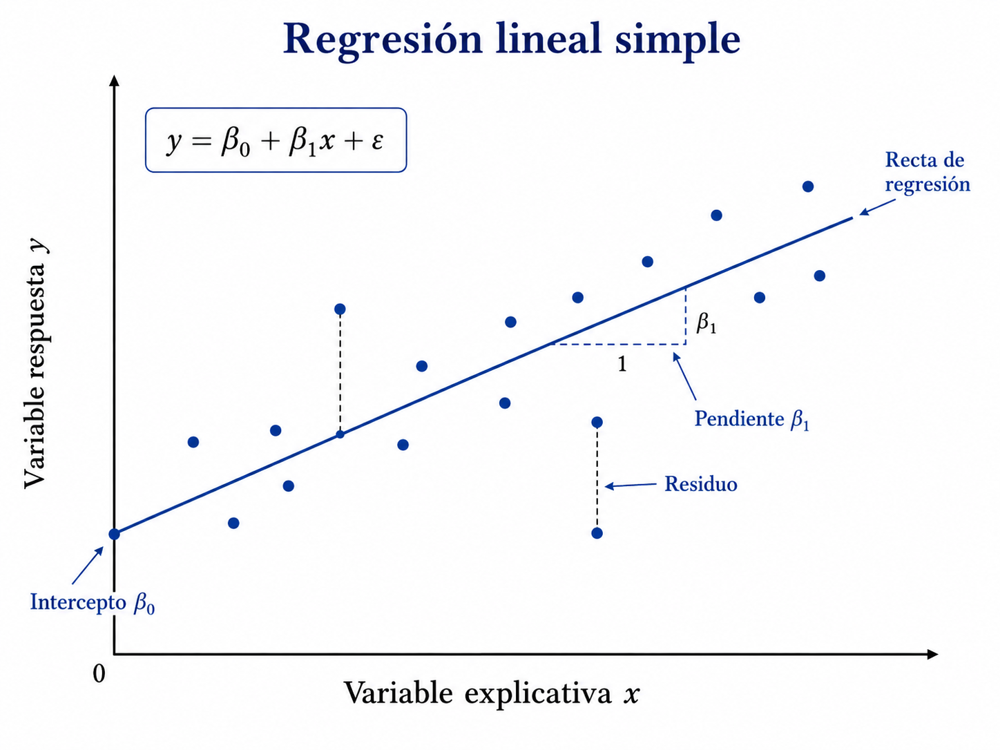

# Regresión lineal simple\index{Regresión lineal simple} {#sec-regresion-lineal-simple}

## Introducción {.unnumbered}

La regresión lineal simple modela la relación media entre una variable respuesta cuantitativa y un predictor. La recta ajustada describe una asociación estadística; por sí sola no establece causalidad [@montgomery2021introduction; @seber2012linear; @james2021introduction].

La regresión lineal simple estudia la relación entre una variable explicativa $X$ y una variable respuesta $Y$. Su propósito es modelar cómo cambia, en promedio, la respuesta cuando cambia la variable explicativa.

Aunque se trata de uno de los modelos más sencillos, constituye la base conceptual de métodos más avanzados. En este capítulo se desarrollan la formulación probabilística, la estimación por mínimos cuadrados, las propiedades de los estimadores, la inferencia sobre los parámetros, los intervalos de confianza y predicción, el coeficiente de determinación y el análisis de residuos.

::: {.callout-important title="Definición esencial" appearance="default" icon="true"}
La regresión lineal simple modela la media de una respuesta con un predictor.
:::

## Objetivos {.unnumbered}

Al finalizar el capítulo, el lector podrá:

1. formular el modelo de regresión lineal simple;
2. interpretar los parámetros $\beta_0$ y $\beta_1$;
3. derivar los estimadores de mínimos cuadrados;
4. interpretar geométricamente el ajuste;
5. demostrar propiedades de insesgadez;
6. calcular varianzas de los estimadores;
7. formular pruebas de hipótesis para la pendiente;
8. construir intervalos de confianza;
9. construir intervalos de predicción;
10. interpretar $R^2$;
11. analizar residuos;
12. reconocer violaciones de supuestos;
13. relacionar la regresión lineal con el aprendizaje supervisado.

## Formulación del modelo {.unnumbered}

Sean observaciones

$$
(x_i,y_i),
\qquad
i=1,\ldots,n.
$$

El modelo de regresión lineal simple es

$$
Y_i
=
\beta_0
+
\beta_1x_i
+
\varepsilon_i.
$$

Aquí:

- $\beta_0$ es el intercepto;
- $\beta_1$ es la pendiente;
- $\varepsilon_i$ es el error aleatorio.

## Interpretación de los parámetros {.unnumbered}

### Intercepto {.unnumbered}

$$
\beta_0
$$

representa el valor esperado de $Y$ cuando

$$
X=0.
$$

Esta interpretación solo es útil si $X=0$ tiene sentido dentro del contexto del problema.

### Pendiente {.unnumbered}

$$
\beta_1
$$

representa el cambio promedio esperado en $Y$ por cada unidad adicional de $X$.

Formalmente,

$$
\mathbb{E}(Y\mid X=x)
=
\beta_0+\beta_1x.
$$

Por tanto,

$$
\frac{d}{dx}
\mathbb{E}(Y\mid X=x)
=
\beta_1.
$$

## Supuestos clásicos {.unnumbered}

Se supone:

### Linealidad {.unnumbered}

$$
\mathbb{E}(Y_i\mid x_i)
=
\beta_0+\beta_1x_i.
$$

### Media cero de los errores {.unnumbered}

$$
\mathbb{E}(\varepsilon_i\mid x_i)=0.
$$

### Varianza constante {.unnumbered}

$$
\operatorname{Var}(\varepsilon_i\mid x_i)
=
\sigma^2.
$$

### Independencia {.unnumbered}

$$
\operatorname{Cov}(\varepsilon_i,\varepsilon_j)=0,
\qquad
i\neq j.
$$

### Normalidad {.unnumbered}

Para inferencia exacta,

$$
\varepsilon_i
\sim
N(0,\sigma^2).
$$

La normalidad no es necesaria para obtener los estimadores de mínimos cuadrados, pero sí para ciertas pruebas e intervalos exactos en muestras pequeñas.

## Función de regresión {.unnumbered}

La función de regresión poblacional es

$$
m(x)
=
\mathbb{E}(Y\mid X=x)
=
\beta_0+\beta_1x.
$$

La recta ajustada es

$$
\widehat{m}(x)
=
\widehat{\beta}_0
+
\widehat{\beta}_1x.
$$

## Criterio de mínimos cuadrados {.unnumbered}

Los residuos son

$$
e_i
=
y_i
-
\widehat{y}_i,
$$

donde

$$
\widehat{y}_i
=
\beta_0+\beta_1x_i.
$$

La suma de cuadrados residual es

$$
S(\beta_0,\beta_1)
=
\sum_{i=1}^{n}
\left(
y_i-\beta_0-\beta_1x_i
\right)^2.
$$

Los estimadores de mínimos cuadrados son

$$
(\widehat{\beta}_0,\widehat{\beta}_1)
=
\arg\min_{\beta_0,\beta_1}
S(\beta_0,\beta_1).
$$

## Derivación de las ecuaciones normales {.unnumbered}

Derivando respecto de $\beta_0$,

$$
\frac{\partial S}{\partial\beta_0}
=
-2
\sum_{i=1}^{n}
\left(
y_i-\beta_0-\beta_1x_i
\right).
$$

Igualando a cero,

$$
\sum_{i=1}^{n}
y_i
=
n\beta_0
+
\beta_1
\sum_{i=1}^{n}
x_i.
$$

Derivando respecto de $\beta_1$,

$$
\frac{\partial S}{\partial\beta_1}
=
-2
\sum_{i=1}^{n}
x_i
\left(
y_i-\beta_0-\beta_1x_i
\right).
$$

Igualando a cero,

$$
\sum_{i=1}^{n}
x_iy_i
=
\beta_0
\sum_{i=1}^{n}
x_i
+
\beta_1
\sum_{i=1}^{n}
x_i^2.
$$

Estas son las ecuaciones normales.

## Estimador de la pendiente {.unnumbered}

Defina

$$
S_{xx}
=
\sum_{i=1}^{n}
(x_i-\overline{x})^2,
$$

$$
S_{xy}
=
\sum_{i=1}^{n}
(x_i-\overline{x})(y_i-\overline{y}).
$$

Entonces,

$$
\widehat{\beta}_1
=
\frac{S_{xy}}{S_{xx}}.
$$

## Estimador del intercepto {.unnumbered}

$$
\widehat{\beta}_0
=
\overline{y}
-
\widehat{\beta}_1\overline{x}.
$$

Por tanto, la recta ajustada pasa por el punto

$$
(\overline{x},\overline{y}).
$$

## Relación con covarianza y varianza {.unnumbered}

La pendiente puede escribirse como

$$
\widehat{\beta}_1
=
\frac{
\widehat{\operatorname{Cov}}(X,Y)
}{
\widehat{\operatorname{Var}}(X)
}.
$$

También,

$$
\widehat{\beta}_1
=
r_{XY}
\frac{s_Y}{s_X},
$$

donde $r_{XY}$ es la correlación muestral.

## Interpretación gráfica de los residuos {.unnumbered}

Cuando se estudian los **errores de regresión** o **residuos**, resulta útil observar la interpretación geométrica del modelo. La siguiente figura muestra la recta de regresión, el intercepto, la pendiente y las distancias verticales entre los datos observados y la recta ajustada.

{#fig-regresion-lineal-simple width=88% fig-alt="Diagrama de regresión lineal simple con una nube de puntos, una recta de ajuste, el intercepto, la pendiente y residuos señalados"}

En esta representación, el residuo de la observación $i$-ésima puede interpretarse como la distancia vertical entre el valor observado $y_i$ y el valor ajustado $\hat{y}_i$. Por tanto,

$$
e_i = y_i - \hat{y}_i.
$$

La pendiente $\beta_1$ describe el cambio esperado en la respuesta cuando la variable explicativa aumenta una unidad, mientras que el intercepto $\beta_0$ corresponde al valor esperado de la respuesta cuando $x=0$.

## Seudocódigo formal {.unnumbered}

::: {.callout-note title="Seudocódigo matemático formal" appearance="default" icon="true"}
```text
Algoritmo MCO-Lineal-Simple
Entrada:
  D = {(x_i, y_i)}_{i=1}^n, con x_i, y_i ∈ ℝ
Salida:
  \hatβ_0, \hatβ_1 y \hat f(x) = \hatβ_0 + \hatβ_1 x

1. Calcular
      \bar x = (1/n) \sum_{i=1}^n x_i,
      \bar y = (1/n) \sum_{i=1}^n y_i.
2. Calcular
      S_{xx} = \sum_{i=1}^n (x_i - \bar x)^2,
      S_{xy} = \sum_{i=1}^n (x_i - \bar x)(y_i - \bar y).
3. Estimar
      \hatβ_1 = S_{xy}/S_{xx},
      \hatβ_0 = \bar y - \hatβ_1 \bar x.
4. Para cada observación, obtener
      \hat y_i = \hatβ_0 + \hatβ_1 x_i,
      e_i = y_i - \hat y_i.
5. Devolver el modelo ajustado \hat f.
```
:::

## Referencias del capítulo {.unnumbered}

Los fundamentos se apoyan en @montgomery2021introduction, @seber2012linear, @hastie2009elements y @james2021introduction.

